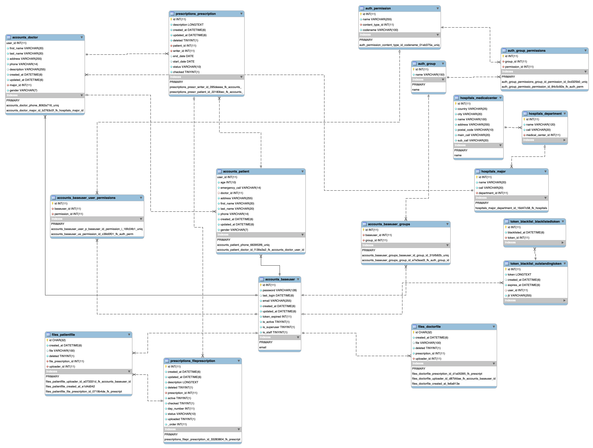

# UT Proejct

### 전체 모델 ERD

 

### TIL

-   Django & DRF
    -   210324: [개선된 만 나이 계산(with db function)](docs/210324.md)
    -   210323: [Project 모델 구조 수정(예정)](docs/210323.md)
    -   210308: [MySQL Function을 이용한 만 나이 계산](docs/210308.md)
    -   210123: [DRF 다중 파일 업로드](docs/210123.md)
    -   210117: [Database(MySQL-docker) 변경](docs/210117.md)
    -   210108: [FileField에 연결된 파일(로컬에 저장된 파일) 삭제](docs/210108.md)
    -   210107: [django에서 list comprehension 및 generator expression 사용 시 주의](docs/210107.md)
    -   201217: [Permission(has_permission & has_object_permission) 오버라이딩](docs/201217.md)
    -   201210: [유저 모델 설정(group & permission)](docs/201210.md)
    -   201204: [Generic View 흐름도 정리](docs/201204.md)

 

-   Celery
    -   201202: [celery 셋팅 및 db backend](docs/celery_doc.md)

