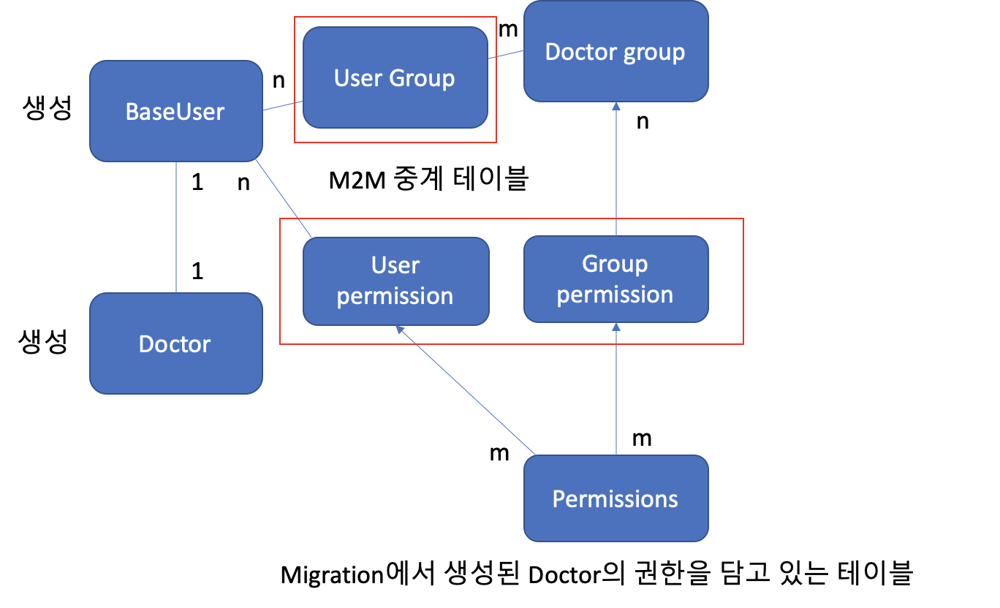

# django(DRF) user group permission

-   사용자 생성 시 serializer에서 사용자의 권한(permission)과 그룹(group)을 설정하기
-   migration 시 생성되는 기본 권한 및 모델에 추가된 권한을 등록
-   되도록 django의 구성을 벗어나지 않도록 설계함

<br>

### 관계도



### 동작 흐름

1.  사용자 생성
    -    BaseUser 생성 -> Doctor 생성 -> Doctor와 BaseUser 관계 형성

2.  Doctor의 권한(view_doctor, add_doctor, ...)을 group permission에 추가(group_permissions 테이블에 등록하는 과정)하고 그룹을 BaseUser에 바인딩

    ```python
    group, created = Group.objects.get_or_create(name=self.role)
        if created:
            group.permissions.set(self.permissions)
        self.baseuser.groups.add(group)
    ```

3.  Doctor의 권한을 BaseUser의 permission에 추가

    ```python
    self.baseuser.user_permissions.set(self.permissions)
    ```

4.  **request.user.has_perm('accounts.view_doctor')**을 이용해 해당 객체 권한을 확인할 수 있다.

-   닥터에 대한 권한: <app_label.codename>


<br>

### 현재 모델 구조

```python
class BaseUser(AbstractUser):
    ...

class Doctor(models.Model):
    user = models.OneToOneField(BaseUser, on_delete=models.CASCADE, primary_key=True)
    ...
    class Meta:
        permissions = (  # 추가 권한
            ("can_add_prescription", "can write prescriptions"),
            ("can_change_prescription", "can change prescriptions "),
            ("can_view_prescription", "can view prescriptions "),
            # ("can_delete_prescription", "can delete prescriptions "),
        )
class Patient(models.Model):
    user = models.OneToOneField(BaseUser, on_delete=models.CASCADE, primary_key=True)  
```

-   두 사용자를 분리해서 사용하기 위해 OneToOneField로 AbstractUser와 관계를 형성
    -   각각의 사용자 모델을 생성할 경우 Django Authentication Backend를 커스터마이징 해야한다.
    -   권한, 인증, 로그인 등 건드려야할 곳이 많아짐

-   codename 'add_prescription'은 겹침(migration 시 자동으로 생성되는 code name을 확인)


<br>

### Serializer

```python
# mixins.py
from django.db import transaction

from accounts.models import BaseUser
from accounts.utils import UserAuthenticationHandler


class UserCreateMixin:
    @transaction.atomic
    def create(self, validated_data):
        user_data = validated_data.pop('user')
        baseuser = BaseUser.objects.create_user(**user_data)
        user = self.Meta.model.objects.create(user=baseuser, **validated_data)

        user_authentication_handler = UserAuthenticationHandler(user=user, baseuser=baseuser)
        user_authentication_handler.set_group_and_permission()
        return user

# serializers.py
class BaseUserSignUpSerializer(UserCreateMixin, serializers.ModelSerializer):
    ...
    
class DoctorSignUpSerializer(BaseUserSignUpSerializer):
    user = BaseUserSignUpSerializer()

    class Meta:
        model = Doctor
        fields = ['user', 'department', 'major']
```

-   [**@transaction.atomic**](https://docs.djangoproject.com/en/3.1/topics/db/transactions/#django.db.transaction.atomic): BaseUser와 User(Doctor 또는 Patient) 모델 중 하나라도 실패할 경우 두 모델 모두 생성하지 않아야 함
-   UserAuthenticationHandler를 이용해 create 메서드에서 로직을 분리
    -   create 메서드가 너무 지저분해져서 분리

<br>

```python
from django.contrib.auth.models import Group, Permission
from django.contrib.contenttypes.models import ContentType


class UserAuthenticationHandler:
    def __init__(self, user=None, baseuser=None):
        self.user = user
        self.baseuser = baseuser
        self.role = None
        self.permissions = None

    def set_group_and_permission(self):
        self.set_role(self.user)
        self.set_permissions()
        self.set_group_as_role()
        self.set_permission_to_baseuser()

    def set_permissions(self):
        content_type = ContentType.objects.get(app_label='accounts', model=self.role)
        self.permissions = Permission.objects.filter(content_type=content_type)

    def set_group_as_role(self):
        group, created = Group.objects.get_or_create(name=self.role)
        if created:
            group.permissions.set(self.permissions)
        self.baseuser.groups.add(group)

    def set_permission_to_baseuser(self):
        self.baseuser.user_permissions.set(self.permissions)

    def set_role(self, user):
        self.role = user.__class__.__name__.lower()

```

<br>

### Objects

-   Permission: migration 시 자동으로 content type에 대한 권한을 가진 permission 테이블을 생성한다. 

    ```python
    >>> Permission.objects.get(codename='view_doctor')
    <Permission: accounts | doctor | Can view doctor>
    ```

    -   content_type, codename, name 필드로 구성되어있다.
    -   codename은 보통 '동작_모델이름'으로 구성한다.
        -   view_doctor, delete_doctor, add_patient 등

-   ContentType: migration 시 앱 라벨(앱 이름)과 해당 앱에 포함된 모델 이름을 담고 있는 content_type 테이블을 생성한다.

    ```python
    >>> ContentType.objects.get_for_model(Doctor)
    <ContentType: accounts | doctor>
    ```

    

