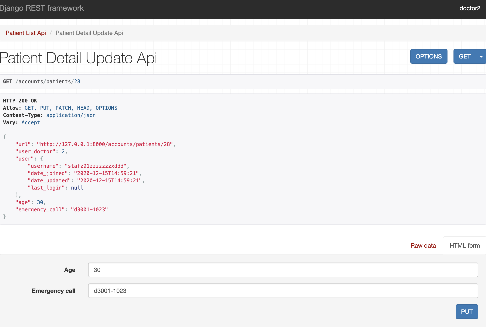
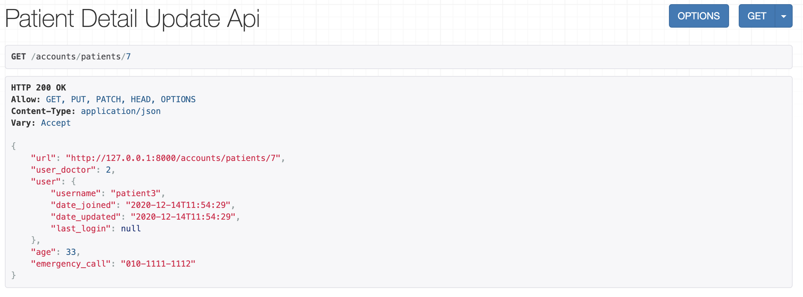

# 201217 - Trouble Shooting(DRF Permissions)

### 문제: view에 (custom)permission을 설정했음에도 적용되지 않는 문제

-   두 개의 퍼미션 클래스에 or 연산을 적용함

    ```python
    # permissions.py
    
    # 특정 사용자(의사)만 접근 가능(읽기 가능)
    class DoctorReadOnly(RootPermission):
        def has_permission(self, request, view):
            return is_safe_method(request) and has_group(request, 'doctor')
    
    # 소유자만 접근 가능(읽기 쓰기 모두 가능)
    class IsOwner(RootPermission):
        def has_object_permission(self, request, view, obj):
            return is_owner(request, obj)
    ```

    <br>

    ```python
    # views.py
    class PatientDetailUpdateAPIView(RetrieveUpdateAPIView):
        queryset = Patient.objects.all()
        serializer_class = serializers.PatientSerailizer
        permission_classes = [DoctorReadOnly | IsOwner]
        lookup_field = 'pk'
    ```

    



-   Input 폼이 생성되면 안됨(PUT을 허용함을 의미).
-   PUT을 날려도 적용됨


### 문제 확인

-   BasePermission 클래스 및 OR 연산에 대한 구성이 아래와 같이 되어있음

    ```python
    # rest_framework.permissions.py
    # OperationHolderMixin,OperandHolder 등 생략(참고할 필요 있음)
    
    class OR:
        def __init__(self, op1, op2):
            self.op1 = op1
            self.op2 = op2
    
        def has_permission(self, request, view):
            return (
                self.op1.has_permission(request, view) or
                self.op2.has_permission(request, view)
            )
    
        def has_object_permission(self, request, view, obj):
            return (
                self.op1.has_object_permission(request, view, obj) or
                self.op2.has_object_permission(request, view, obj)
            )
    
    
    class BasePermission(metaclass=BasePermissionMetaclass):
        """
        A base class from which all permission classes should inherit.
        """
    
        def has_permission(self, request, view):
            """
            Return `True` if permission is granted, `False` otherwise.
            """
            return True
    
        def has_object_permission(self, request, view, obj):
            """
            Return `True` if permission is granted, `False` otherwise.
            """
            return True
    
    ```

    -   BasePermission을 상속받는 모든 클래스에 has_permission과 has_object_permission이 적용됨

    -   BasePermission의 두 메서드는 항상 **True를** 반환함

    -   현재 적용된 custom permission은 각각 **has_permission과** **has_object_permission을 한 개씩** 오버라이딩함

        -   문제 발생

            -   실제 권한을 확인하는 코드는 아래와 같이 적용됨

                ```python
                # permission_classes = [DoctorReadOnly | IsOwner]
                result = DoctorReadOnly.has_permission(False) | IsOwner.BasePermission.has_permission(True)
                ```

                -   **무조건 result는 True가 반환됨!!!!**

            

### 1차 시도

-   Custom Permissions의 부모 클래스에 항상 **False**를 반환하는 **has_object_permission**과 **has_permission** 메서드 생성

    ```python
    class RootPermission(BasePermission):
        def has_object_permission(self, request, view, obj):
            return False
    
        def has_permission(self, request, view):
            return False
          
          
    class DoctorReadOnly(RootPermission):
        def has_permission(self, request, view):
            return is_safe_method(request) and has_group(request, 'doctor')
    
    
    class IsOwner(RootPermission):
        def has_object_permission(self, request, view, obj):
            return is_owner(request, obj)
    ```

    ```python
    # views.py
    PatientDetailUpdateAPIView(RetrieveUpdateAPIView):
        permission_classes = [DoctorReadOnly | IsOwner]
    
    # request.doctor의 GET
    DoctorReadOnly.has_permission(True) | IsOwner.BasePermission.has_permission(False) => True
    
    # 객체 owner의 접근
    DoctorReadOnly.BasePermission.has_object_permission(False) | IsOwner.has_object_permission(True) => True
    ```

    -   환자의 정보에 의사는 접근(GET)만 할 수 있고, 환자는 자신의 정보(객체)에 접근하거나 수정(PUT)할 수 있다.

<br>

### 추가 문제: Detail page에 접근하기 위해서는 반드시 get_object()가 호출되어야 함

-   **get_object()** 내부에 **check_object_permissions** 실행되면서 **DoctorReadOnly.RootPermission.get_object_permission** 호출하고 **False** 반환............

<br>

### Solution

-   따라서 get_object()를 호출하는 Detail이나 Update, Delete 페이지에 대한 권한은 반드시 **has_object_permission**도 구성해야한다.

    ```python
    class DoctorReadOnly(RootPermission):
        def has_permission(self, request, view):
            return self._doctor_read_only(request)
    
        def has_object_permission(self, request, view, obj):
            return self._doctor_read_only(request) and bool(obj.user_doctor == request.user.doctor)
    
        def _doctor_read_only(self, request):
            return is_safe_method(request) and has_group(request, 'doctor')
    
    ```

    -   has_object_permission()

        -   care_doctor: 환자의 주치의가 로그인한 의사와 동일한지 확인
        -   동작 순서: GET method 확인 -> request 유저가 doctor 그룹인지 확인 -> 환자의 주치의가 request 유저와 동일한지 확인(request 처리 순서로 동작)
            -   마지막 순서가 없을 경우, 주치의가 아닌 의사가 환자의 정보에 접근이 가능해짐(의도하지 않음)

        

    

    

    -   Input 폼이 생성되지 않으면서 의도한대로 동작


### has_permission & has_object_permission

-   has_permission(self, request, view): view까지 접근 할 수 있는가?
    -   List와 같이 get_object()가 호출되지 않을 경우 has_permission()만 정의해도 가능

-   has_object_permission(self, request, view, obj): view까지 접근한 후 해당 object까지 접근할 수 있는가?
    -   Detail(Retrieve), Update등 get_object() 객체가 호출되어야 할 경우 반드시 has_object_permission() 필요

