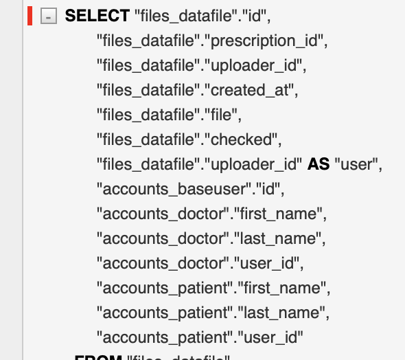

# 210107

### list comprehsion & generator expression 사용 시 주의

-   queryset.only()를 이용해 불필요한 필드를 제거 시도

-   only에 들어갈 필드를 list와 generator를 이용해 사용

    -   list로 필드값을 메모리에 가지고 있는것보다 제너레이터로 query가 실행될 때 불러오는게 좋을 것 같다고 생각함

    ```python
    # files/models.py
    DEFAULT_QUERY_FIELDS = ['id', 'prescription', 'uploader_id', 'file', 'created_at']
    UPLOADER_QUERY_FIELDS = ['user_id', 'first_name', 'last_name']
    DOCTOR_QUERY_FIELDS = (f'uploader__doctor__{field}' for field in UPLOADER_QUERY_FIELDS)
    PATIENT_QUERY_FIELDS = (f'uploader__patient__{field}' for field in UPLOADER_QUERY_FIELDS)
    
    class DataFileQuerySet(models.QuerySet):
        def necessary_fields(self, *fields):
            return self.only(*DEFAULT_QUERY_FIELDS, *DOCTOR_QUERY_FIELDS, *PATIENT_QUERY_FIELDS, *fields)
    ```

    ```python
    class DataFileListAPIView(ListAPIView):
        def get_queryset(self):
            user = self.request.user
            queryset = super().get_queryset().necessary_fields()
            if user.is_superuser:
                return queryset
            return queryset.filter_current_user(uploader=user)
    ```

    <br>

    정상 동작

    

    <br>

    ### 문제점

    -   새로고침을 하거나 다른 브라우저를 이용해 endpoint에 접근할 때 only가 적용되지 않음

    

    <br>

    ### 해결

    -   **generator**는 값을 **소모**하기 때문에 한 번 사용된 후 메모리에서 사라짐

    -   서버가 실행되는 동안 따라서 새로고침을 하거나 다른 브라우저에서 동일한 서버 접근 시 **DOCTOR_QUERY_FIELDS**와 **PATIENT_QUERY_FIELDS** 에 저장된 필드는 사라지게 됨

    -   따라서 반드시 반복적으로 적용되어야 하거나 서버가 실행되는 동안 계속 유지되어야 하는 값(특히 매개변수에 사용될 값)에는 제너레이터를 사용하면 안 됨

        ```python
        DOCTOR_QUERY_FIELDS = [f'uploader__doctor__{field}' for field in UPLOADER_QUERY_FIELDS]
        PATIENT_QUERY_FIELDS = [f'uploader__patient__{field}' for field in UPLOADER_QUERY_FIELDS]
        ```

        