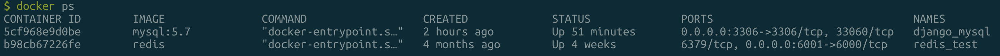
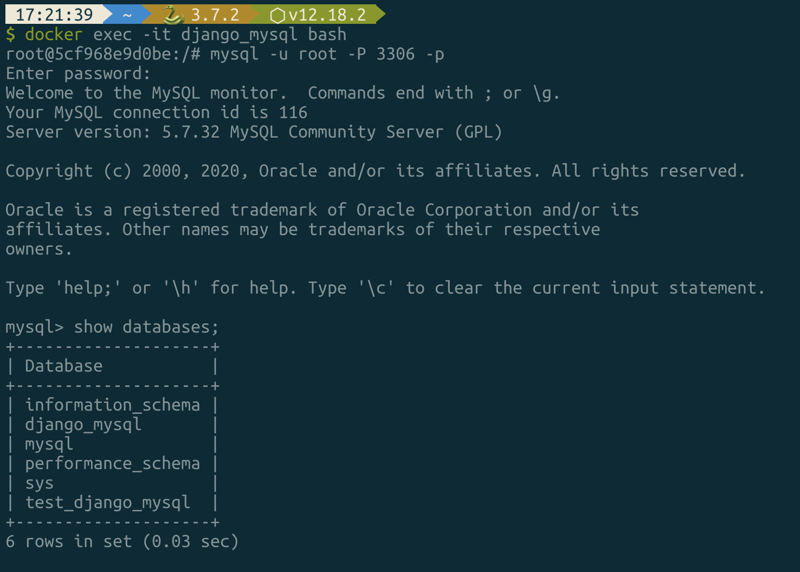
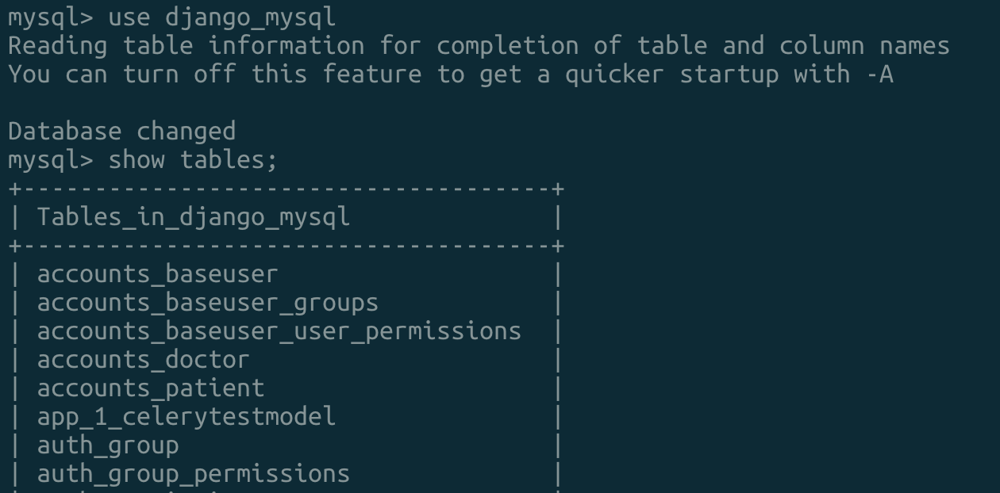

# 210117

### Django 데이터베이스 MySQL 변경

데이터베이스를 기존의 SQLite에서 MySQL(Docker)로 변경

<br>

-   데이터베이스 커넥터 설치

    ```python
    $ pip install mysqlclient                                                                                      
    ```

    

<br>

**Django settings.py**

```python
# SQLite(주석 처리 예정)
DATABASES = {
    'default': {
        'ENGINE': 'django.db.backends.sqlite3',
        'NAME': os.path.join(BASE_DIR, 'db.sqlite3'),
    }
}
```


<br>

### MySQL - [Docker Setting](https://www.notion.so/navill/Docker-volume-e7756547f89b4dbca5760850407cfc01)


-   Container 생성 - Volume, Port 설정
    -   image는 official mysql image를 사용
    -   [network(bridge)](https://www.notion.so/navill/Docker-2b23c2ba5c584303a1c36b9776cd40ac) 설정은 추후 진행

```python
$ docker run -d --name django_mysql \  # -d: background mode 동작
-e MYSQL_ROOT_PASSWORD=test1234 \  # mysql root password
-e MYSQL_DATABASE=django_mysql \  # db name
-v /Users/jh/django_mysql_dir:/etc/mysql \  # set volume-> <local dir>:<docker dir>
-p 3306:3306 \  # <local_port>:<docker_port>
mysql:5.7  # <image_name>:<version>
```

<br>



-   container 실행(bash로 실행)

```python
$ docker exec -it django_mysql /bin/bash
```



-   MySQL CharacterSet - 한글 설정
    -   캐릭터 셋 설정을 하지 않을 경우 한글 입력 시 오류 발생

```python
# /etc/my.cnf
[mysqld]
init_connect="SET collation_connection=utf8_general_ci"
init_connect="SET NAMES utf8"
character-set-server=utf8
collation-server=utf8_general_ci
skip-character-set-client-handshake
[client]
default-character-set=utf8
[mysql]
default-character-set=utf8
```

<br>

-   migration

    ```python
    $ python manage.py makemigrations --settings=config.settings.local                                               
    $ python manage.py migrate --settings=config.settings.local 
    ```

**migration 확인**




### Fixture를 이용한 기존 데이터 복사

-   기존 데이터베이스(SQLite)의 데이터 dumping

-   settings.py의 설정은 SQLite로 설정

    ```python
    # <app_name>.<model_name>: 해당 모델의 데이터만 추출
    $ python manage.py dumpdata accounts.BaseUser --indent 4 > fixtures/baseuser_fixture.json --settings=config.settings.local
    
    # <app_name>: 앱 전체의 모델 데이터 추출
    $ python manage.py dumpdata accounts --indent 4 > fixtures/accounts_fixture.json --settings=config.settings.local
    ```


-   fixture 파일 확인 후 settings.py의 데이터베이스를 MySQL로 변경 

-   이후 fixture 데이터를 MySQL 데이터베이스로 복사

    ```python
    $ python manage.py loaddata fixtures/accounts_fixture.json --settings=config.settings.local 
    ```

    

Reference: [RunPython을 이용하는 방법](https://cjh5414.github.io/django-fixture-runpython/)