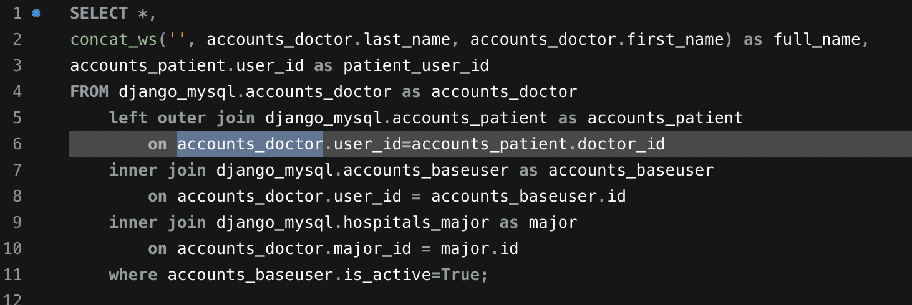
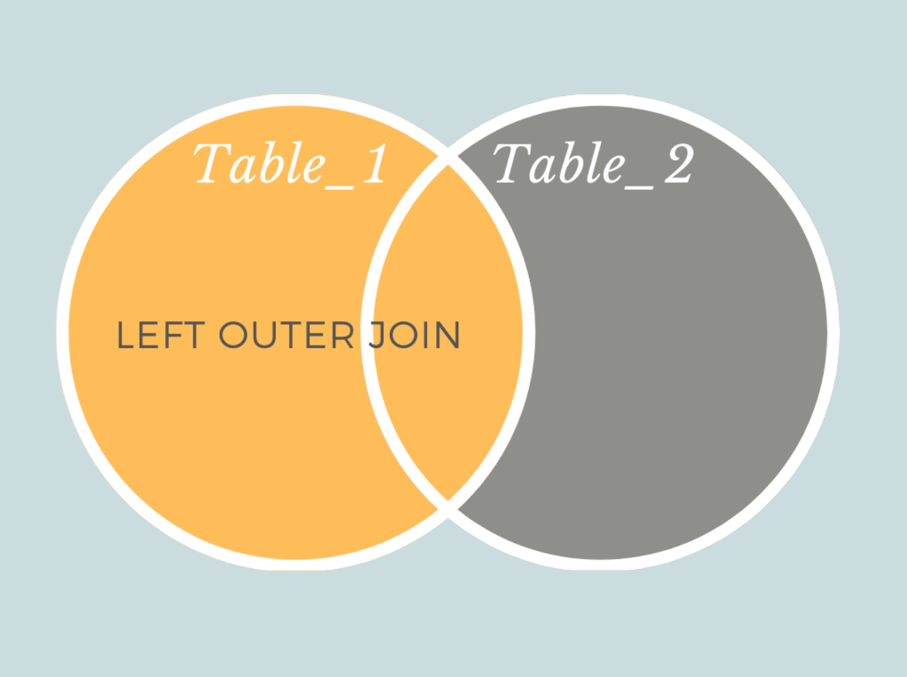
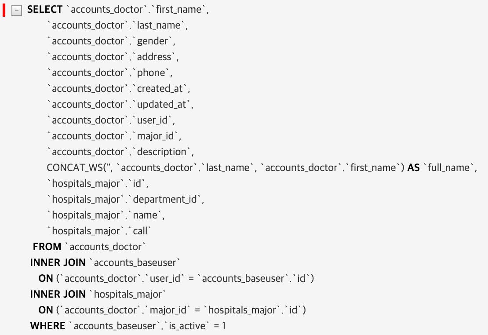
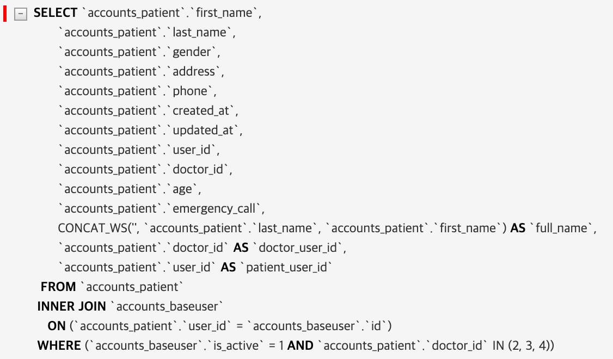

# 210127

### Annotate 문제

-   api 접근 시 접근 권한을 검사하기 위해 쿼리셋에 annotate를 이용한 연관된 id 필드 생성

-   doctor_list를 출력할 때 데이터베이스에는 한 개의 엔트리만 존재하지만 중복된 값이 출력되는 문제 발생

    <br>

    **[동일한 유저가 중복되어 출력]**

    

    

-   환자와 의사의 관계를 끊을 경우 정상적인 값이 출력 -> queryset의 문제라고 생각

    ```python
    # models.py
    class DoctorQuerySet(models.QuerySet):
        def filter_user_active(self):
            return self.filter(user__is_active=True)
    
        def prefetch_all(self):
            return self.prefetch_related('patients')
    
        def select_all(self):
            return self.select_related('major')
    
    class DoctorManager(models.Manager):
        def get_queryset(self) -> DoctorQuerySet:
            return DoctorQuerySet(self.model, using=self._db). \
                annotate(full_name=concatenate_name(), patient_user_id=F('patients__user_id')).filter_user_active()  # annotate 구문
            
    # views.py
    class DoctorListAPIView(ListAPIView):
        queryset = Doctor.objects.select_all().prefetch_all()
    ```
    
**SQL query - (select_related 구문)**
    

    
-   annotate 구문에서 patient_user_id를 생성하기 위해 역참조(patient)를 위한 left outer join이 발생
    
    
    
    -   left outer join을 통해 patient와 연결된 doctor를 join
        -   patient요소(table1) **+** 기존의 doctor 요소(table2) **+** left outer join에 의해 불려온 doctor 요소(table1과 table2에 중복되는 부분) => 중복값 출력


<br>

### Solution(미해결)

-   위에서 발견한 문제 처럼 left outer join에 해당하는 부분을 select_related 쿼리가 아닌 다른 쿼리(prefetch로 인한 +1 query)로 옮김
-   중복 문제는 해결되지만 의도한 annotate를 사용하지 못함

```python
class DoctorQuerySet(models.QuerySet):
    def prefetch_all(self):
        return self.prefetch_related(
            Prefetch('patients', queryset=Patient.objects.annotate(patient_user_id=F('user_id'))))

    # def prefetch_all(self):
    #    return self.prefetch_related('patients')
      
    def select_all(self):
        return self.select_related('major')


class DoctorManager(models.Manager):
    def get_queryset(self) -> DoctorQuerySet:
        return DoctorQuerySet(self.model, using=self._db). \
            annotate(full_name=concatenate_name()).filter_user_active()
```

<br>

**SQL query - (select_related 구문)**



**SQL query - (prefetch_related 구문)**



-   위 코드는 doctor.patients.patient_user_id로 접근해야함(doctor.patients.user_id와 동일) = **의미없는 코드**
    -   실제 코드에서는 두 번째 prefetch_related('patients')을 사용


