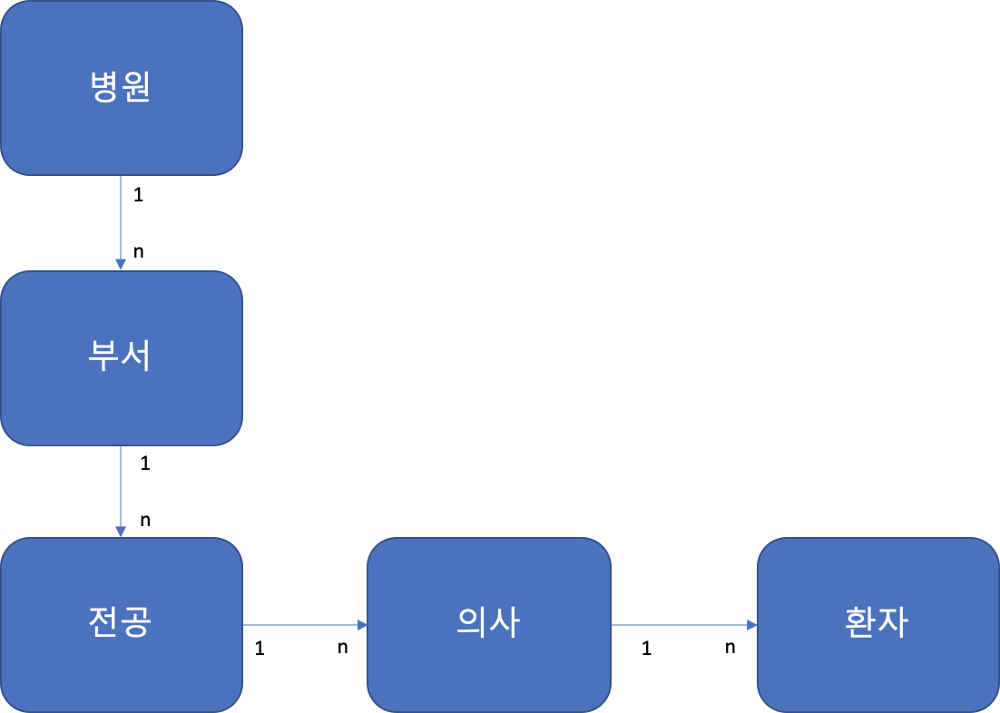
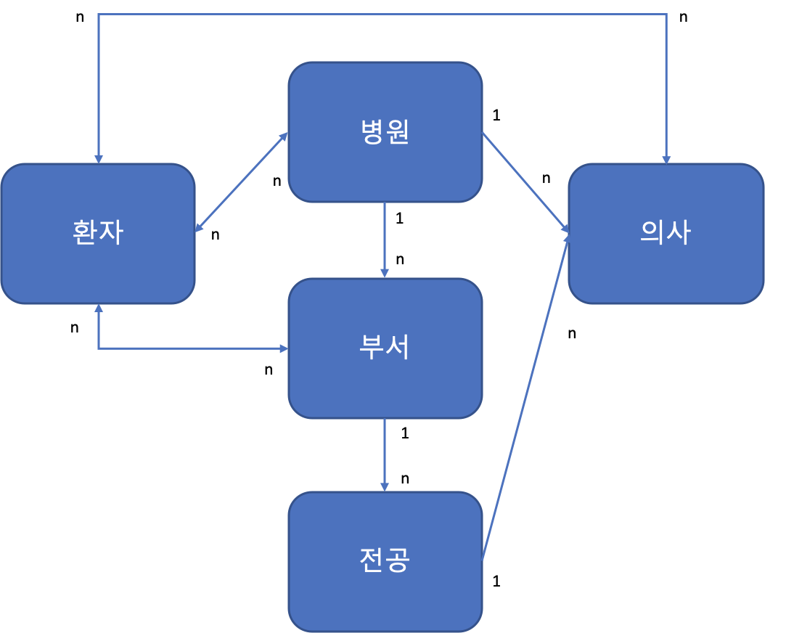

# 210323

### 병원, 환자, 의사 관계

-   처음 구조를 설계할 때 환자와 의사 관계를 중심으로 설계
    -   실제 병원에서 사용될 수 있는 구조로 생각하지 않음(설계 미스)

 

### 현재 모델 구조(잘못된 구조)

-   의사가 병원을 그만둘 경우 환자는?
    -   환자의 데이터는 남지만 환자의 소속(병원)이 불분명해짐
-   병원 내 모든 환자를 검색할 경우?
    -   병원 -> 부서 -> 전공 -> 의사 -> 환자 순으로 쿼리 검색(비효율)
-   병원 내 모든 의사를 검색할 경우?
    -   병원 -> 부서 -> 전공 -> 의사 순으로 쿼리 검색(비효율)
-   환자가 한 부서가 아닌 여러 부서에서 진료를 받을 경우?
    -   현재 의사에게 ForeignKey로 연결되어있어 불가능

 

### 개선될 모델 구조

-   현실 구조와 유사하도록 설계

-   병원은 환자, 의사, 그리고 부서(+전공) 세 가지의 큰 카테고리를 갖는다.
    -   병원이라는 기관은 해당 병원의 부서 및 전공을 가지고 있음

    -   새로운 환자가 병원에 등록하거나, 새로운 의사가 병원에 취업 할 수 있음

        -> 병원과 관계 형성

        -   환자는 여러 병원에 등록할 수 있고 병원도 여러 환자를 받을 수 있음(Many To Many)
        -   의사는 오직 한 병원에 취업 할 수 있고(One To Many), 병원 전공 중 한 가지 전공을 선택할 수 있음(여러 전공을 선택하는 의사가 있는지는 고려하지 않음-One To Many)

    -   병원에 내원한 (병원과 관계가 형성된)환자가 부서(ex: 신경외과, 흉부외과 등)에 진료를 등록

        -> 환자 및 부서 관계 형성

    -   이후 전공의가 환자를 담당하게 됨

        -> 환자 및 의사 관계 형성

        -   환자는 한 병원에서 여러 부서에서 진료를 받을 수 있음(Many To Many)
        -   환자는 한 부서에서 여러 의사에게 진료를 받을 수 있음(한 부서에서 여러 의사가 협진할 수 있다고 가정함-Many To Many)

