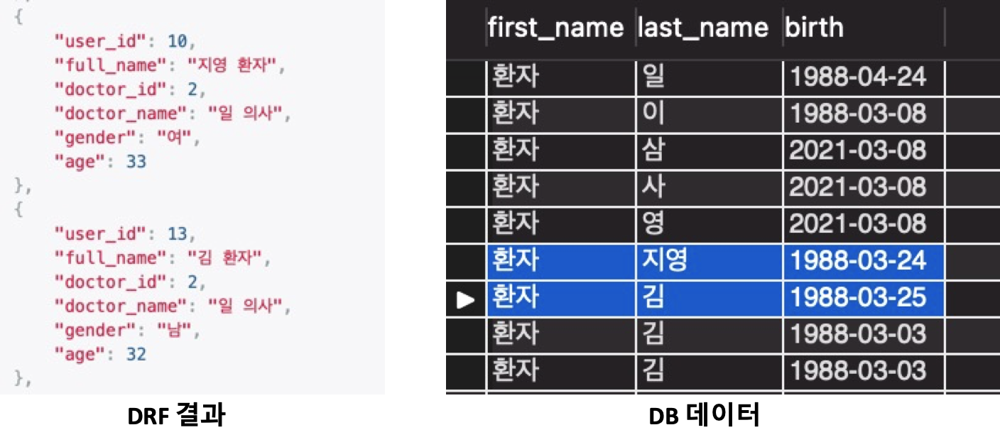
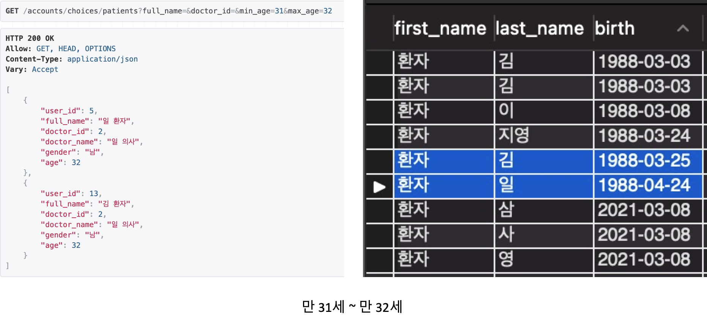
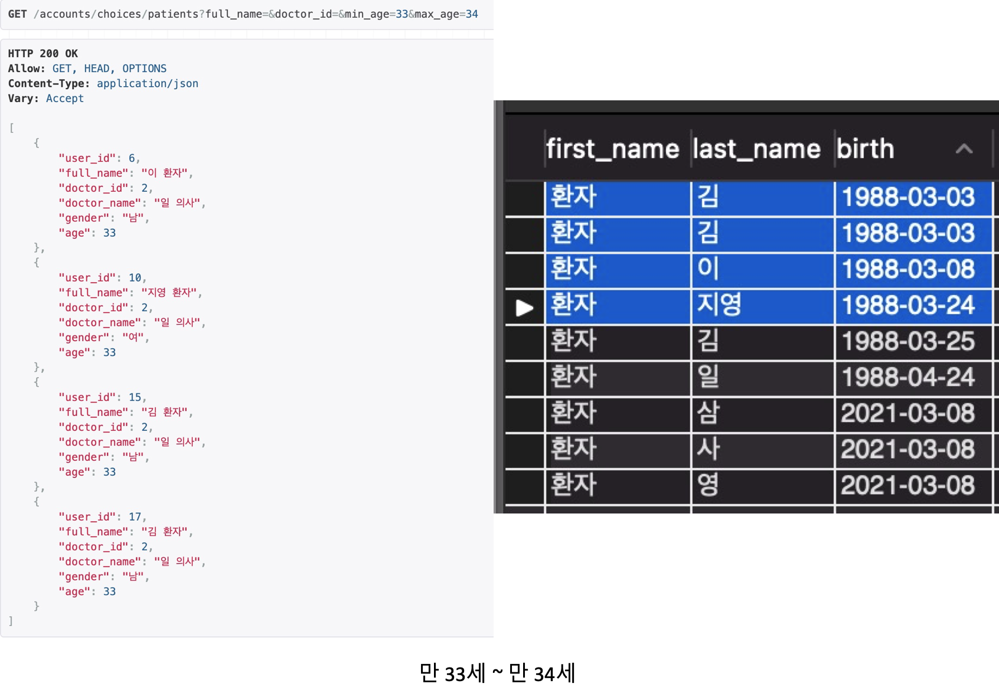

# 210323

### Django를 이용한 만 나이 계산

[나이 계산을 위한 MySQL Function](#mysql-function)


-   사용자 객체에 'birth'필드를 생성하고, 만 나이를 자동으로 계산
-   만 나이는 날짜(생일)에 따라 자동으로 결과가 출력되어야 함
    -   3월 24일 기준: 1988년 3월 24일(만 33세), 1988년 3월 25일(만 32세)
        -   생일이 지나지 않은 사람은 만 나이가 1살 더 어림
        -   DB에 나이를 직접 입력해놓을 경우 날짜에 따라 갱신되지 않음

<br>

---


## 기본 구조

-   사용자 모델에 birth 필드 생성
-   DB(MySQL)의 Function을 이용해 django의 쿼리문(ORM) 실행 시 birth(생년월일)를 자동으로 나이로 변환
-   변환된 나이를 annotate()를 사용해 age필드 출력
-   django filters 적용
    -   annotate로 생성된 age의 범위값을 통한 필터 기능이 제대로 동작하지 않음

<br>

## MySQL Function

**만 나이 계산 쿼리 - 문제점**

-   많은 블로그에서 아래와 같은 구조로 만 나이 계산 쿼리를 작성한 것을 확인

    ```mysql
    select truncate((to_days(now())-(to_days('1988-03-24')))/365, 3);
    -- output: 33.021
    ```

    -   3월 24일 기준으로 88년 3월 24일생의 만 나이는 33세
    -   하지만 3월 25일생의 만 나이는?

    ```mysql
    select truncate((to_days(now())-(to_days('1988-03-25')))/365, 3);
    -- output: 33.019
    ```

    -   24일생과 마찬가지로 33세로 출력

-   to_days 함수는 0000년을 기준으로 입력된 날짜까지의 일 수를 결과로 출력
    -   윤년(366일)이 반영되지 않기 때문에 365로 값을 나눌 경우 위와 같은 오차가 생길 수 있음

<br>

**해결법**

-   생년월일과 현재 날짜의 차를 이용해 만 나이를 구함

    ```mysql
    select 20210324-19880324;
    -- output: 330000
    select 20210324-19880325;
    -- output: 329999  
    
    select floor((cast(replace(current_date, '-', '') as unsigned) - cast('19880324' as unsigned)) / 10000);
    -- output: 33
    
    select floor((cast(replace(current_date, '-', '') as unsigned) - cast('19880325' as unsigned)) / 10000);
    -- output: 32
    ```

    -   생일이 지나지 않은 사람 또한 정상적으로 만 나이가 출력됨

-   정상 동작하는 쿼리를 이용해 **MySQL Function** 생성

    ```mysql
    CREATE DEFINER=`root`@`%` FUNCTION `calculate_age`(birth_date DATE) RETURNS int(11)
    	BEGIN
    		declare result_age integer default 0;
    		set result_age = floor((cast(replace(current_date, '-', '') as unsigned) - cast(birth_date as unsigned)) / 10000);
    	RETURN result_age;
    END
    ```

<br>

## Django(REST Framework)에 MySQL function 적용

-   django의 Func을 이용해 MySQL의 function을 실행할 클래스 생성

    ```python
    # database_functions.py
    from django.db.models import Func
    
    
    class CalculateAge(Func):
        """
        MySQL - FUNCTION
           CREATE DEFINER=`root`@`%` FUNCTION `calculate_age`(birth_date DATE) RETURNS int(11)
           BEGIN
             declare result_age integer default 0;
             set result_age = floor((cast(replace(current_date, '-', '') as unsigned) - cast(brith_date as unsigned)) / 10000);
           RETURN result_age;
           END
        """
        function = 'calculate_age'
    
    ```

-   사용자(Patient)의 queryset에 **annotate**를 사용하여 위 클래스 적용

    ```python
    # models.py
    class PatientQuerySet(CommonUserQuerySet):   # CommonUserQuerySet: custom class
        def set_age(self) -> 'PatientQuerySet':
            return self.annotate(age=CalculateAge('birth'))
          
    class PatientManager(CommonUserManager):  # Manager
        def get_queryset(self) -> PatientQuerySet:
            return PatientQuerySet(self.model, using=self._db). \
                annotate(full_name=concatenate_name(),
                         doctor_name=concatenate_name('doctor')). \
                filter_user_active(). \
                set_age()  # <- Patient manager를 사용할 때 age가 설정됨
                            
    class Patient(AccountsModel):  # Model
        user = models.OneToOneField(BaseUser, on_delete=models.CASCADE, primary_key=True)
        birth = models.DateField()
        
        objects = PatientManager()
    ```

-   Serializer 적용

    ```python
    # serializers.py
    class PatientListSerializer(AccountSerializer):
        age = serializers.SerializerMethodField()
    
        class Meta:
            model = Patient
            fields = PatientFields.list_field
    
        def get_age(self, instance: Patient) -> int:
            return instance.age
    ```

    -   age는 모델에 정의되어있지 않고, Model Manager(queryset 생성)이 실행되기 전에 존재하지 않음

    -   SerializerMethodField()를 사용해 queryset으로부터 생성된 instance의 age를 출력

        

<br>

## Django Filter 적용

-   django filter를 이용해 특정 범위의 나이를 검색하는 기능 구현

-   age 필드는 db function으로 생성되며, annotate의 매개변수에 나이 계산을 위한 python 함수가 들어갈 수 없음

    -   기존 django filters 적용되지 않음

    ```python
    >>> print(patients.filter(age__gte='33'))
    django.core.exceptions.ValidationError: ['“33” value has an invalid date format. It must be in YYYY-MM-DD format.']
    ```

    -   age__gte비교 구문에 들어갈 값은 db funtion의 결과값이 아닌 **입력값(type: date)**과 동일한 타입이 되어야 함

    ```python
    >>> print(patients.filter(age__lte='1988-03-24').query)
    SELECT ... ON (`accounts_patient`.`user_id` = `accounts_baseuser`.`id`) 
    WHERE (`accounts_baseuser`.`is_active` = True AND calculate_age(`accounts_patient`.`birth`) <= 1988-03-24)
    ```

    -   사용자가 나이 범위를 입력했을 때(예: 30~32세 범위의 사용자를 출력하라) 나이를 생년월일로 변경하는 함수가 필요함

<br>

**나이를 생년월일로 변경하는 함수**

```python
# api/utils.py
def calculate_birthdate(min_age: int, max_age: int) -> List[datetime.date]:
    ages = [min_age, max_age]

    result_date = []

    for number, age in enumerate(ages):
        calculated_year = datetime.datetime.now() - relativedelta(years=age + number)
        calculated_age = calculated_year.date() + relativedelta(day=calculated_year.day + number)
        result_date.append(calculated_age)

    result_date.sort()  # 나이 많은 사람의 생년월일(min_date) 순서로 정렬
    return result_date
```

-   최소나이(30세): 1991년 3월 24일 이전에 태어난 사람들(생일이 지난(혹은 오늘이 생일인))
    -   생일이 지나지 않았을 경우 만 29세
-   최대나이(32세): 1988년 3월 25일 이후에 태어난 사람들(생일이 지나지 않음)
    -   생일이 지났을 경우 만 33세
-   최대 나이와 최소 나이가 같을 경우(33세): 1987년 3월 25일생부터 1988년 3월 24일생까지

<br>

### queryset

```python
# models.py
class PatientQuerySet(CommonUserQuerySet):
    def filter_between_age(self, min_age: int, max_age: int) -> 'PatientQuerySet':
        from accounts.api.utils import calculate_birthdate

        # 3월 24일 기준
        max_date = calculate_birthdate(min_age)  # min 30(1991.03.24 ~ 1990.03.23)  
        min_date = calculate_birthdate(max_age, is_max_age=True)  # max 32(1989.03.24 ~ 1988.03.25)
        
        return self.filter(birth__lte=max_date, birth__gte=min_date)
```

-   최소 나이(1991)와 최대 나이(1988)을 비교할 때 **반대로** 코드를 구성해야함

    -   나이가 **많은(max_age)** 사람의 생년월일(**min_date**)이 나이가 **적은(min_age)** 사람보다 생년월일(**min_date**)의 **크기가 작음**

    -   출력될 나이의 범위는 1988년 3월 25일(32세) 부터 1991월 3월 24일(30세)까지를 출력

<br>


### filters

```python
# filters.py
class PatientFilter(FilterSet):
    full_name = CharFilter(field_name='full_name', label='full name')
    doctor_id = NumberFilter(field_name='doctor_id', label='doctor id')
    min_age = NumberFilter(label='min age')
    max_age = NumberFilter(label='max age')

    # disease_code = CharFilter(field_name='disease_code')

    class Meta:
        model = Patient
        fields = ['full_name', 'doctor_id', 'min_age', 'max_age']  # + ['disease_code]

    def filter_queryset(self, queryset):
        cleaned_data = self.form.cleaned_data
        min_age = cleaned_data.pop('min_age') or 1
        max_age = cleaned_data.pop('max_age') or 999

        if min_age > max_age:
            raise ValidationError('must be minimum age less then maximum age')

        if max_age or min_age:
            queryset = queryset.filter_between_age(min_age, max_age)

        return super().filter_queryset(queryset)

```

-   full_name과 doctor_id는 기존의 django filters로 처리 가능
-   min_age와 max_age를 처리할 수 있는 filter_queryset 메서드를 작성

<br>

### 실행결과





