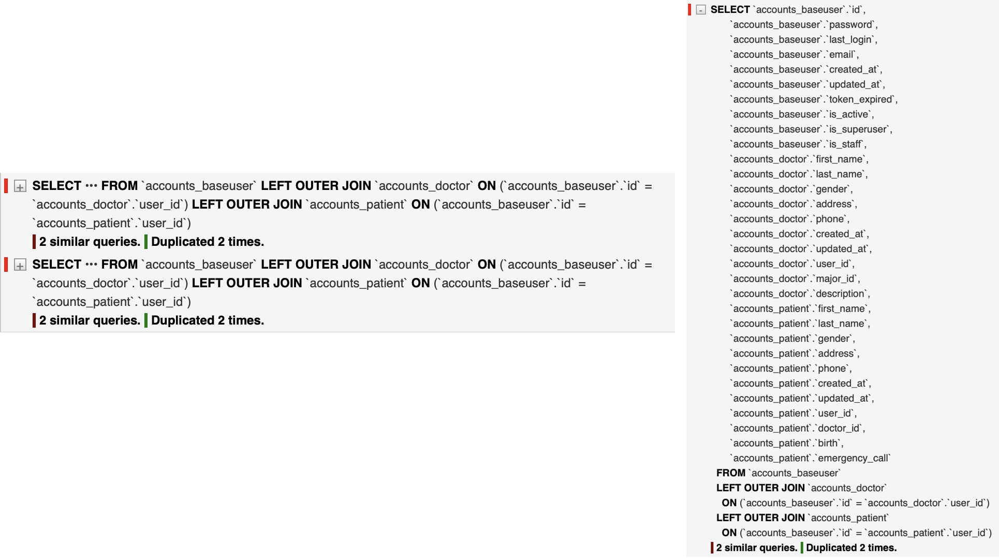

# 210326

### django filters로 인한 중복 쿼리 발생

-   Patient 객체 필터링 적용 후 아래와 같은 중복 쿼리 발생

    -   우측 그림은 BaseUser, Patient, Doctor가 select된 쿼리문으로 BaseUser의 Manager(기본 쿼리)에 설정되어있음

    

    ```python
    # filters.py
    class PatientFilter(FilterSet):
        full_name = CharFilter(field_name='full_name', label='full name')
        doctor_id = NumberFilter(field_name='doctor_id', label='doctor id')
        min_age = NumberFilter(label='min age', method='filter_min_age')
        max_age = NumberFilter(label='max age', method='filter_max_age')
    
        # disease_code = CharFilter(field_name='disease_code')
    
        class Meta:
            model = Patient
            fields = ['full_name', 'doctor_id', 'min_age', 'max_age', 'user_id']
    ```

    -   환자를 선택 리스트에서 필터 기능을 적용하기 위해 위와 같이 Filter class를 구성

<br>

### 원인

-   Meta.fields에는 **user_id** 가 등록되어있지만 **클래스 속성**에는 존재하지 않는다.

-   BaseFilterSet.filter_queryset, FilterSet.filterset_factory, PatientChoicesAPIView.get_queryset() 확인 결과 이상없음

    

    -   위 그림과 같이 DRF Browsable API에서 Filter form을 생성하기 위해 User field를 지정된queryset이 아닌 추가로 가져오게 됨

<br>

### 해결

```python
class PatientFilter(FilterSet):
    user_id = NumberFilter(field_name='user_id', label='user id')
```

-   user_id를 NumberFilter()로 지정

    -   사용자가 필터링하기 위한 값은 user_id(Integer)가 필요하므로 위와 같이 설정

    