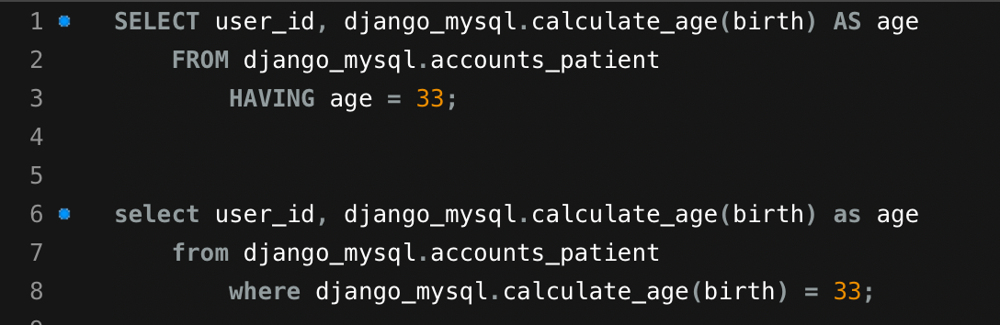
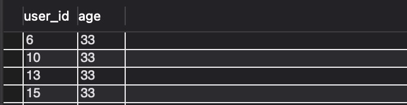
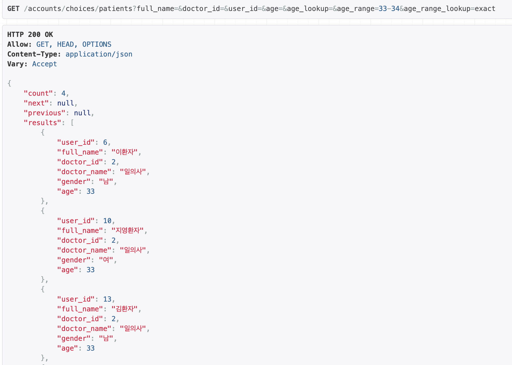

# 210401

### 만 나이 계산 기능 개선 - 나이를 이용한 필터링

```python
# filters.py
class PatientFilter(FilterSet):
	  ...
    def filter_min_age(self, queryset: QuerySet, name: str, value: int) -> QuerySet:
        max_birth_date = self._get_calculated_birth(name, value)
        return queryset.filter(birth__lte=max_birth_date)

    def filter_max_age(self, queryset: QuerySet, name: str, value: int) -> QuerySet:
        min_birth_date = self._get_calculated_birth(name, value)
        return queryset.filter(birth__gte=min_birth_date)

    def _get_calculated_birth(self, name: str, age: int) -> datetime.date:
        extra_number = 0
        if name == 'max_age':
            extra_number = 1
        calculated_year = datetime.datetime.now() - relativedelta(years=age + extra_number)
        calculated_result = calculated_year + relativedelta(days=extra_number)
```

-   calculated_age('birth') (DB)함수에서 생성된 결과값(age)을 integer로 인식하지 못함(date 타입으로 인식)

-   ORM query문에 lookup expression을 사용하지 못함

    -   만 33세를 필터링할 경우 나이를 생년월일 범위(4월 1일 기준 - 87년 4월 2일 ~ 88년 4월 1일)로 변환해서 검색해야함

    


<br>

### TEST

**Django ORM** 

```python
>>> patient = Patient.objects.annotate(age=CalculateAge('birth')).filter(age=33)

# error 출력
django.core.exceptions.ValidationError: ['“33” value has an invalid date format. It must be in YYYY-MM-DD format.']

```

-   나이를 이용해 annotate된 age를 검색할 경우 에러 출력
    -   에러 메세지를 확인하고 입력값을 생년월일로 변경하여 아래와 같이 테스트

<br>

```python
>>> patient = Patient.objects.annotate(age=CalculateAge('birth')).filter(age='1988-01-01')
>>> print(patient.query)  # 에러 없이 쿼리 출력

SELECT `accounts_patient`.`first_name`, ... FROM `accounts_patient`
...
calculate_age(`accounts_patient`.`birth`) = 1988-01-01)

>>> patient  
<PatientQuerySet []>  # 결과 없음
```

-   생년월일을 이용해 age를 필터링할 경우 에러는 출력되지 않지만 결과가 출력되지 않음

-   MySQL Function calculate_age의 결과값은 integer, 입력값은 date type

    -   calculate_age('accounts_patient'.'birth') 구문을 **DATE Type으로 인식**

    -   django에서 ORM에서 function의 매개변수 타입으로 입력값을 Validation하는 것으로 예상

**MySQL**

-   Query 실행 순서( [HAVING - Notion](https://www.notion.so/navill/QUERY-HAVING-GROUP-BY-4fee8c3a0c2d4248a130ac6e07177ad8))에 따라 쿼리문에 사용될 함수의 위치가 다름

    

    -   **FROM -> WHERE -> SELECT -> GROUP BY -> HAVING** 순서로 실행됨

        -   HAVING절에서 나이를 검색할 경우 SELECT에 Function 위치 가능
        -   WHERE절에서 나이를 검색할 경우 WHERE절에서 Function 이 실행되어야 함
            -   **MySQL에서는 WHERE절의 함수 결과를 INTEGER로 인식함**

    -   두 쿼리 모두 나이를 이용해 사용자를 검색할 수 있음(원하는 동작)

        

    

### 수정

```python
# models.py
class PatientQuerySet(CommonUserQuerySet):
    def add_extra_for_age(self, expression: str) -> 'PatientQuerySet':
        if expression:
            return self.extra(where=[expression])  # where에서 Function 실행
        return self
```

-   filter queryset에서 사용할 queryset 메서드 추가
    -   검색을 계속 해봤는데 having을 추가하는 메서드는 사라진듯 함
    -   where 구문에 나이를 출력하는 Function 구문 추가


<br>

```python
# filters.py
class CustomLookupChoiceFilter(LookupChoiceFilter):  # 입력값 검증
    def validate_value(self, value: str) -> NoReturn:
        if not value.isnumeric():
            raise ValidationError(f"'{value}' can not be converted to integer")


class AgeLookupChoiceFilter(CustomLookupChoiceFilter):  # 나이 검색
    def filter(self, qs, lookup):
        if not lookup:
            return super(LookupChoiceFilter, self).filter(qs, None)

        self.lookup_expr = lookup.lookup_expr
        self.validate_value(lookup.value)
        expression = create_extra_expression({self.lookup_expr: lookup.value})
        return qs.add_extra_for_age(expression)


class AgeRangeLookupChoiceFilter(CustomLookupChoiceFilter):  # 나이 범위 검색
    def filter(self, qs, lookup):
        if not lookup:
            return super(LookupChoiceFilter, self).filter(qs, None)

        self.lookup_expr = lookup.lookup_expr
        min_age, max_age = lookup.value.replace(' ', '').split('-')
        for age in min_age, max_age:
            self.validate_value(age)

        expression = create_extra_expression({'lte': max_age, 'gte': min_age})
        return qs.add_extra_for_age(expression)
      
      
class PatientFilter(FilterSet):
    user_id = NumberFilter(field_name='user_id', label='user id')
    full_name = CharFilter(field_name='full_name', label='full name')
    doctor_id = NumberFilter(field_name='doctor_id', label='doctor id')
    age = AgeLookupChoiceFilter(  # filterset에 커스텀 필터 적용
        field_class=NumberFilter.field_class,
        field_name='age',
        lookup_choices=[
            ('exact', 'Equals'),
            ('gte', 'Greater than'),
            ('lte', 'Less than')
        ], label='환자의 나이')
    age_range = AgeRangeLookupChoiceFilter(
        field_class=CharFilter.field_class,
        field_name='age',
        lookup_choices=[
            ('exact', 'Equals')
        ], label='환자 나이 범위 검색(ex: 10-20)'
    )

    class Meta:
        model = Patient
        fields = ['full_name', 'doctor_id', 'user_id', 'age', 'age_range'] 

```

-   django_filters의 LookupChoiceFilter를 커스터마이징

    -   lookup expression에 따른 표현식을 create_extra_expression 함수에서 생성

        ```python
        # filter_backends.py
        LOOKUP_OPERATOR = {
            'exact': '=',
            'lte': '<=',
            'gte': '>='
        }
        
        def create_extra_expression(target_expressions: Dict[str, int]) -> str:
            expr_container = []
            function_name = 'django_mysql.calculate_age(birth)'
        
            for name, value in target_expressions.items():
                expr_container.append(f"{function_name} {LOOKUP_OPERATOR[name]} {value}")
        
            extra_expression = f"{expr_container[0]} AND {expr_container[1]}" if len(expr_container) == 2 \
                else expr_container[0]
        
            return extra_expression
        ```

        -   일단 하드 코딩으로 구현. 소프트 코딩으로 변경은 추후에...

<br>

### 결과




-   만 33세부터 만 34세까지 범위 검색 결과 정상 출력
-   Query 결과 또한 원하는 방식으로 동작

