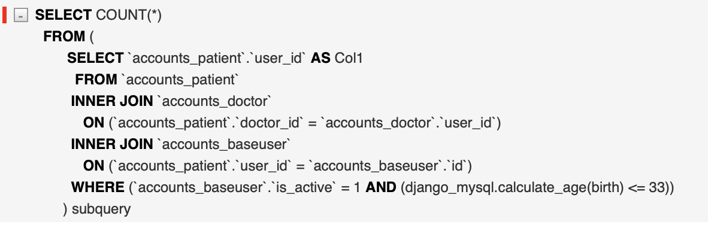

# 210402

### DRF Pagination 최적화

-   pagination을 사용할 경우 count() 또는 get_count() 메서드가 동작하면서 queryset.count()를 실행

    -   model queryset -> filter queryset -> pagination queryset 순서로 동작

    ```python
    # drf - pagination.py
    class LimitOffsetPagination(BasePagination):
        def get_count(self, queryset):
            """
            Determine an object count, supporting either querysets or regular lists.
            """
            try:
                return queryset.count()
            except (AttributeError, TypeError):
                return len(queryset)
    ```

    

    -   Patient manager에 annotate 구문(함수 실행을 통한 age 필드 출력)이 실행됨

<br>

-   단지 page값을 출력하기 위해서는 불필요한 SQL 구문을 제거할 필요가 있음

    -   full_name, doctor_name, age는 page 값을 출력하기위해 필요하지 않은 필드

        ```python
        class FasterPagination(LimitOffsetPagination):
            def get_count(self, queryset: QuerySet) -> int:
                id_field = 'id'
                try:
                    if issubclass(queryset.model, AccountsModel):
                        id_field = 'user_id'
                    return queryset.values(id_field).count()
                except (AttributeError, TypeError):
                    return len(queryset)
        ```

        -   LimitOffsetPagination의 get_count를 오버라이딩
            -   id를 이용한 count() 실행
            -   Patient 및 Doctor 모델은 One-To-One으로 BaseUser와 연결되어있기 때문에 'id'필드 대신 'user_id' 필드가 존재
            -   두 모델은 AccountModel을 상속 받기 때문에 issubclass() 함수로 모델을 확인하여 values()에 들어갈 id 필드를 설정함

        

