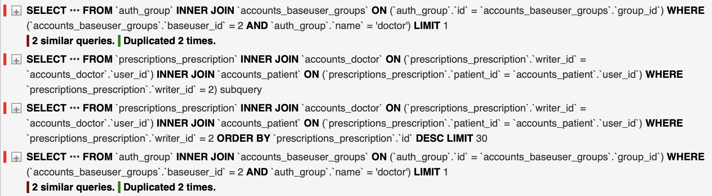
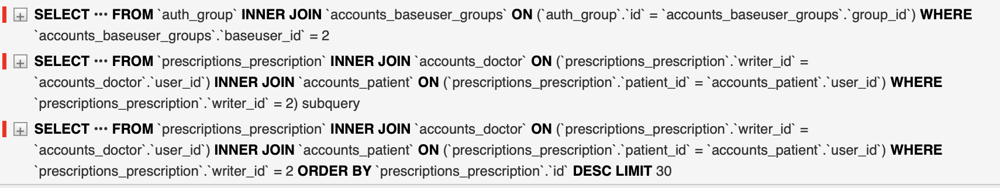

# 210406

### request.user의 permission 검사 최적화

-   view에 접근 시 먼저 사용자의 인증 여부(is_authentication)를 확인

-   접근하고자 하는 객체에 따라 유저의 타입(환자인지? 의사인지?)를 확인

-   일반적으로 request.user에서 사용자를 확인할 수 있음

    ```python
    def get(request, ...):
        if request.user.is_doctor:
            return Response(...)
    ```

<br>

### 개선 전

**Permission**

```python
class PermissionMixin:
	  ...
    def has_group(self, request: Request, group_name: str) -> bool:
        return request.user.groups.filter(name=group_name).exists()

# permissions.py
class RootPermission(PermissionMixin, BasePermission):
    pass

class IsDoctor(RootPermission):
    def has_permission(self, request: Request, view: View) -> bool:
        is_auth = self.is_authenticated(request)
        # has_group(<request: Request>, <group_name: str>)
        is_doc = self.has_group(request, 'doctor') 
        return True if is_auth and is_doc else False
```

-   has_group(\<group_name: str\>): User(request.user)의 그룹이 의사인지 환자인지 확인



-   has_group 관련 query가 두번 실행됨
    -   view에 접근하는 reuqest.user의 permission을 체크하는 과정에서 일어남

<br>

**Model**

```python
# models.py
class BaseUser(AbstractBaseUser, PermissionsMixin):
		# old
    @property
    def is_doctor(self) -> bool:
        return hasattr(self, 'doctor')

    # new
    @property
    def is_doctor(self) -> bool:
        return self.groups.filter(name='doctor').exists()

```

-   old: User 객체가 doctor 속성을 갖고 있는지를 이용해 사용자 타입 확인
    -   잘못된 방법이라고 생각함
-   new: groups에서 필터링을 통한 타입 확인
    -   타입 확인이 필요할 때 마다 쿼리 추가
-   **둘다 문제**

<br>

### 개선 후  

-   사용자가 View접근할 때 가장 먼저 일어나는 인증 과정에서 사용자의 객체 타입 확인
-   **사용자의 객체(request.user == BaseUser)에 타입을 저장**
-   이후 사용자의 타입을 확인할 때 **객체에 저장된 타입**으로 확인
    -   확인 과정에서 데이터베이스에 접근하지 않기 때문에 추가 쿼리 발생 X

<br>

```python
# authentications.py
def set_type_to(user: User) -> NoReturn:
    group_name = list(user.groups.values_list('name', flat=True))[0]
    user.set_user_type(group_name)
    
class CustomJWTTokenUserAuthentication(JWTAuthentication):  # token 인증
    def get_user(self, validated_token: Dict[str, AnyStr]) -> User:
        # set_type_to(user) 적용(코드 생략)

class CustomBaseAuthentication(BasicAuthentication):  # id&password 인증
    def authenticate_credentials(self, userid, password, request=None):
        user, _ = super().authenticate_credentials(userid, password, request=request)
        set_type_to(user)
        return user, _
```

-   전달된 인증 정보가 올바를 경우 사용자 객체를 반환
-   user.groups에서 그룹 이름을 가져온 후 set_type_from_group 함수를 통해 BaseUser.set_user_type(\<group_name: str\>) 호출

<br>

```python
# models.py
class BaseUser(AbstractBaseUser, PermissionsMixin):
    ...
    USER_TYPE = None  # class attribute
    def set_user_type(self, group_name):
        self.USER_TYPE = UserType(group_name)  # Has-a(composition)
```

-   BaseUser.set_user_type(\<grou_name: str\>): 모델 객체에 유저의 타입을 설정
    -   USER_TYPE = UserType(group_name): 상속관계가 아닌 Composition 관계

```python
# models.py
class UserType:
    def __init__(self, group_name: str):
        self._doctor = False
        self._patient = False
        self.group_name = group_name
				self.initialize()
        
    @property
    def doctor(self) -> bool:
        return self._doctor

    @doctor.setter
    def doctor(self, is_doctor: bool) -> NoReturn:
        self._doctor = is_doctor
        self.validate_type()

    @property
    def patient(self) -> bool:
        return self._patient

    @patient.setter
    def patient(self, is_patient: bool) -> NoReturn:
        self._patient = is_patient
        self.validate_type()

    def validate_type(self) -> NoReturn:  # 설정된 타입 유효성 검사
        if self.doctor and self.patient:
            self.reset_user_type()
            raise ValidationError('invalid user type')

    def validate_group(self) -> NoReturn:  # 입력된 group_name 유효성 검사
        if self.group_name not in ['doctor', 'patient']:
            raise ValidationError('invalid group name')

    def initialize(self):
        self.validate_group()
        setattr(self, self.group_name, True)
        self.validate_type()

    def reset_user_type(self) -> NoReturn:
        self.doctor = False
        self.patient = False
```

-   타입에 대한 유효성 검사등을 포함한 유저 타입 클래스 구성
    -   BaseUser와 UserType을 분리
-   여기까지 과정을 거치면 BaseUser 객체에서 사용자의 타입을 확인할 수 있음

<br>

```python
class IsDoctor(RootPermission):
    def has_permission(self, request: Request, view: View) -> bool:
        is_auth = self.is_authenticated(request)
        is_doc = request.user.USER_TYPE.doctor
        return True if is_auth and is_doc else False
```

-   request.user.USER_TYPE.doctor는 추가 쿼리를 생성하지 않음




### 결론

-   개선 전 코드를 이용해 Browsable API로 endpoint에 접근하지 않을 경우 문제가 되지 않음

    -   JSON(Render)으로 접근 시 중복 쿼리가 발생하지 않음

-   But, 성능 개선 및 수정에 의해 실행 중 사용자의 타입을 확인해야할 경우가 발생할 수 있음

    -   authentication -> view -> model로 접근하는 과정에서 추가적으로 사용자의 타입을 검사하고 이에 따른 제한이나 동작의 변경이 필요할 수 있음 => 사용자 타입 확인을 위한 쿼리가 추가됨

-   복잡하고 큰 데이터가 아닐 경우 모델 객체의 속성에 저장하고 필요할 때 사용함으로써 데이터베이스 접근을 줄일 수 있음

    

