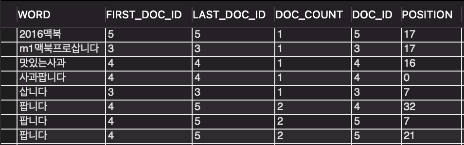
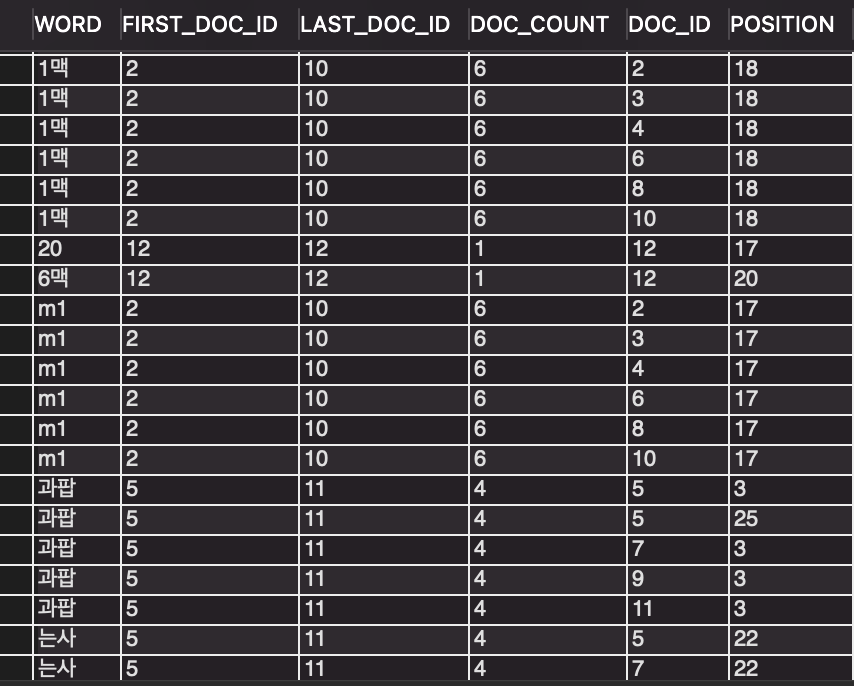

# 210407

### MySQL Full-Text Search(n-gram) 적용

[MySQL](#mysql)

[Django 적용](#django)

<br>

### MySQL

-   의사가 작성한 소견서의 내용을 검색하기 위해 Full-Text Search를 적용
    -   장문으로 작성된 소견서의 내용을 MySQL의 LIKE(django의 description__icontains)로 처리하는 것은 어렵다고 생각함

-   MySQL 5.6부터 내장 DB 엔진(InnoDB or MyISAM)이 Full-text search 알고리즘을 지원함

    -   구분자 기법(Stopword): 전문 내용을 공백이나 구분자로 사용된 문자를 기준으로 키워드를 분석하고 결과 단어를 인덱스로 생성, 검색에 사용

        -   생성된 키워드의 뒷부분만 검색이 불가능(검색어: 사과(인덱싱된 키워드), 본문: 맛있는사과 -> 검색 불가)

        -   Test - [MySQL 공식 manual 참고](https://www.movefeng.com/mysql-manual/fulltext-stopwords.html#fulltext-stopwords-stopwords-for-innodb-search-indexes)

            ```mysql
            create table stopwords_articles(
            id int unsigned auto_increment not null primary key,
            title varchar(200),
            body text)
            engine=innodb;
            
            SELECT * FROM INFORMATION_SCHEMA.INNODB_FT_DEFAULT_STOPWORD;  # default 구분자들 목록
            show tables from information_schema like 'INNODB_FT%';  # fulltext 관련 설정 스키마
            
            insert into stopwords_articles(title, body) values
            ('맥북 삽니다','m1맥북프로삽니다'), ('사과팝니다','맛있는사과 팝니다'), ('맥북 팝니다','2016맥북 팝니다');
            
            create fulltext index idx on stopwords_articles(title, body);  # full text index 설정
            set global innodb_ft_aux_table='sys/stopwords_articles';  # set full text table(<db_name>/<table_name>)
            
            select * from stopwords_articles where match(title, body) against('삽니다');  # 검색 가능
            select * from stopwords_articles where match(title, body) against('팝니다');  # 검색 가능
            select * from stopwords_articles where match(title, body) against('프로');  # 검색 불가
            
            select * from INFORMATION_SCHEMA.INNODB_FT_INDEX_TABLE limit 15;  # 구분자 확인
            ```

            -   글자의 중간이나 마지막 글자는 검색이 불가능(공백을 기준으로 검색)

                

                -   생성된 구분자 확인(select * from INFORMATION_SCHEMA.INNODB_FT_INDEX_TABLE;)

    -   n-gram 기법: 전문 내용을 특정 글자의 크기 만큼(token) 잘라서 인덱싱

        -   아래의 설정을 MySQL의 config 파일에 추가

            ```shell
            # /etc/mysql/my.cnf
            [mysqld]
            ...
            ngram_token_size=2  # token의 크기 설정(1~10)
            ```

            

        -   Stopwords 기법보다 전문 검색이 용이함

            ```mysql
            create table articles(
            id int unsigned auto_increment not null primary key,
            title varchar(200),
            body text,
            fulltext ft_idx (title,body) with parser ngram)
            engine=innodb character set utf8mb4;
            
            -- 기존 테이블에 full text index 추가
            alter table articles add fulltext index ft_index(title, body) with parser ngram;
            
            insert into articles (title, body) values 
            ('맥북 삽니다','m1맥북프로삽니다'), ('사과팝니다','맛있는사과 팝니다'), ('맥북 팝니다','2016맥북 팝니다');
            set global innodb_ft_aux_table = 'sys/articles';  # 검색 테이블 설정
            
            select * from articles where match(title, body) against('맥북');  # 검색 가능(사과 검색 X)
            select * from articles where match(title, body) against('팝니다');  # 검색 가능(맥북, 사과 검색 O)
            select * from articles where match(title, body) against('있는');  # 검색 가능(맥북 검색 X)
            
            select * from INFORMATION_SCHEMA.INNODB_FT_INDEX_CACHE;
            ```

            

            -   검색을 위해 생성된 Token 확인(select * from INFORMATION_SCHEMA.INNODB_FT_INDEX_CACHE;)


### Django

**Migration 작성**

MySQL에서 직접 ALTER 쿼리를 추가하지 않고 django의 migrations에서 설정함

```shell
$ python manage.py makemigrations prescriptions --empty --settings=config.settings.local_test_set 
Migrations for 'prescriptions':
  prescriptions/migrations/0004_auto_20210407_1739.py
  
```

-   현재 작성된 마지막 migration 파일(0003_auto_20210305_0144)을 이어서 작성하기 위해 비어있는 마이그레이션 파일(0004_auto_20210407_1739.py)을 생성함
    -   migration도 git 처럼 트리 구조로 이어져있음

<br>

```python
# prescriptions/migrations/0004_auto_20210407_1739.py
from django.db import migrations


class Migration(migrations.Migration):

    dependencies = [
        ('prescriptions', '0003_auto_20210305_0144'),
    ]
    
    operations = [
        # 추가된 코드: full text search를 사용할 수 있도록 RunSQL()에 ALTER 쿼리 작성
        migrations.RunSQL(
            sql='ALTER TABLE prescriptions_prescription '
                'ADD FULLTEXT INDEX ft_prescription_description(description) '
                'WITH PARSER ngram;',
            reverse_sql='ALTER TABLE prescriptions_prescription DROP INDEX idx_description;')
    ]
```

-   MySQL에 적용될 쿼리를 작성하고 migrate

    ```shell
    # 되도록 manage.py migrate <app_name>을 사용해야함.....
    $ python manage.py migrate --settings=config.settings.local_test_set                   
    Operations to perform:
      Apply all migrations: accounts, admin, auth, contenttypes, ..., sessions, token_blacklist
    Running migrations:
      Applying prescriptions.0001_initial... OK
      Applying files.0001_initial... OK
      Applying prescriptions.0002_auto_20210205_1307... OK
      Applying prescriptions.0003_auto_20210305_0144... OK
      Applying prescriptions.0004_auto_20210407_1739... OK
    ```

-   Full-Text를 사용할 수 있는 설정이 완료됨

<br>

**Full-Text를 사용할 수 있도록 query expression 적용을 위한 커스텀 Lookup 코드 작성**

```python
# prescriptions/models.py

@models.TextField.register_lookup
class FullTextSearch(models.Lookup):
    lookup_name = "search"

    def as_mysql(self, compiler, connection):
        # lhs(left hand side): filter(description__search='hi')에서 description을 의미함
        lhs, lhs_params = self.process_lhs(compiler, connection)  
        # rhs(right hand side): filter(description__search='hi')에서 'hi'를 의미함
        rhs, rhs_params = self.process_rhs(compiler, connection)  
        params = lhs_params + rhs_params

        return f"MATCH (%s) AGAINST (%s IN BOOLEAN MODE)" % (lhs, rhs), params
```

-   Full text search index를 사용할 때는 반드시 MATCH() ... AGAINST() 구문을 사용해야함
-   Prescription 모델에서 사용하는 TextField에 커스텀 룩업을 등록함
    -   'search'를 이용한 query expression 작성 가능

<br>

**Test**

```python
>>> from prescriptions.models import *
>>> prescriptions = Prescription.objects.filter(description__search='ate').values('id','description')
>>> Prescription.objects.filter(description__search='ate').values('id','description')
<PrescriptionQuerySet [{'id': 16, 'description': 'update prescription'}]>
```

-   정상적으로 전문 검색이 출력됨

-   django에서 검색 시 자동으로 IN BOOLEAN MODE로 전문 검색이 실행됨

    ```python
    SELECT ... WHERE MATCH (`prescriptions_prescription`.`description`) AGAINST (ate IN BOOLEAN MODE) ...
    ```

    -   IN BOOLEAN MODE: 검색 결과에 따라 유사하지 않은 값들은 출력하지 않음

<br>

전문 검색 시 참고해야할 내용: [MySQL Boolean full-text search opeartor](https://www.mysqltutorial.org/mysql-boolean-text-searches.aspx/)

