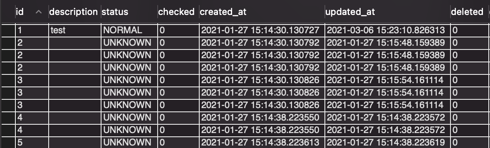
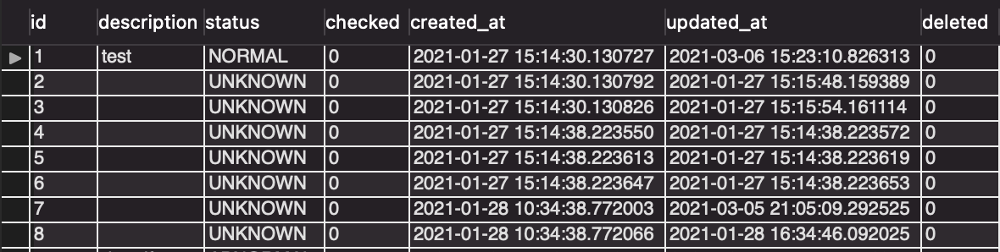
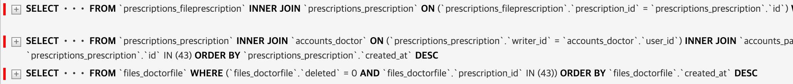
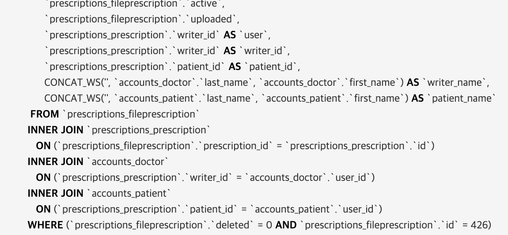
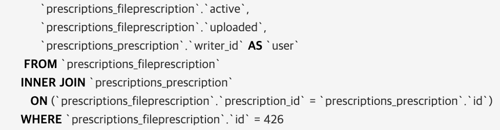

# 210421


## [중복 값 출력 문제 해결](#중복값-출력-문제-해결) & [추가내용: Model Manager](#추가내용-model-manager)

<br>

### 중복값 출력 문제 해결

-   삭제된 DoctorFile 목록을 출력하지 않기 위해 serializer에 `source='not_deleted'` 구문 추가

-   Prescription View는 정상적으로 동작

-   FilePrescription 관련 View에서 문제 발생

-   관계: DoctorFile (n:1) Prescription (1:n) FilePrescription

    >   ex: DoctorFile에서 Prescription은 정관계, Prescription에서 DoctorFile은 역관계

    <br>

    -   **[문제]** 중복값이 출력되는 문제

        ```python
        # old version: deleted=False 필터 적용전
        queryset = FilePrescription.objects.nested_all()
        
        # new version(Test): deleted=False 필터 적용
        queryset = FilePrescription.objects.filter(prescription__doctor_files_deleted=False)
        queryset.values_list('id')
        # 중복된 아이디가 출력됨
        >><FilePrescriptionQuerySet [(450,), (450,), (449,), (449,), (446,), (446,), (445,), (445,), (444,), (444,), (443,), (443,), (442,), (442,), (441,), (441,), (440,), (440,), (439,), (439,), 
        ```

        -   단순히 filter에서 관계를 접근함

        -   Test - MySQL 

            ```sql
            -- django: queryset = FilePrescription.objects.filter(prescription__doctor_files_deleted=False)
            
            
            use django_mysql;
            
            select * from prescriptions_fileprescription
            inner join prescriptions_prescription on (prescriptions_fileprescription.prescription_id=prescriptions_prescription.id)
            inner join files_doctorfile on (prescriptions_prescription.id=files_doctorfile.prescription_id);  -- 문제 쿼리
            ```

            

            -   [참고 - 210127-Annotate 사용 중 중복 쿼리 문제](docs/210127.md)
            -   FilePrescription 테이블에 Prescription 테이블 + Prescription.id와 일치하는 DoctorFile 테이블을 INNER JOIN 하는 과정에서 중복 값 발생

            <br>

            ```sql
            -- 문제 쿼리 제거
            select * from prescriptions_fileprescription
            inner join prescriptions_prescription on (prescriptions_fileprescription.prescription_id=prescriptions_prescription.id)
            ```

            

            -   중복쿼리 없음

        <br>

    -   **[해결]** django prefetch 적용

        -   기존 serializer를 지원하기 위해 Prefetch(..., to_attr='not_deleted') 추가

        ```python
        queryset = FilePrescription.objects.prefetch_related(
                   Prefetch('prescription',
                         queryset=Prescription.objects.prefetch_related(
                             Prefetch('doctor_files', queryset=DoctorFile.objects.filter(deleted=False),
                                      to_attr='not_deleted'))
                   )
        )
        ```

        

        -   중복값 없이 정상 출력 - prefetch_related로 인해 각각의 모델 쿼리 생성


### 추가 내용: Model Manager

-   위 문제를 해결하면서 한 가지 구조적 문제에 대해 생각하게 됨

-   default manager(objects)에 select, prefetch, annotate 등 여러 구문이 추가되어있음

    ```python
    class FilePrescriptionManager(models.Manager):
        def get_queryset(self) -> 'FilePrescriptionQuerySet':
            return FilePrescriptionQuerySet(self.model, using=self._db). \
                filter(deleted=False).annotate_user().\
    		        annotate(writer_id=F('prescription__writer_id'),
                         patient_id=F('prescription__patient_id'),
    										 writer_name=concatenate_name('prescription__writer'),
    										 patient_name=concatenate_name('prescription__patient'))
    
        def prefetch_all(self) -> 'FilePrescriptionQuerySet':
            return self.get_queryset().prefetch_all()
    
        def select_all(self) -> 'FilePrescriptionQuerySet':
            return self.get_queryset().select_all()
    
        def nested_all(self) -> 'FilePrescriptionQuerySet':
            return self.get_queryset().nested_all()
    
        def choice_fields(self) -> 'FilePrescriptionQuerySet':
            return self.get_queryset().choice_fields()
    
    ```

    -   모든 View에서 공통적으로 사용하기 위해 default manager에 위와같이 구성함

-   앞선 문제와 같이 prefetch를 이용할 경우 db에서 JOIN을 실행하지 않고, 각각의 쿼리 결과를 바탕으로 파이썬에서 결합(db의 JOIN처럼)

    -   writer_name, patient_name 사용하지 않음

    -   각 테이블을 조회할 때 JOIN이 필요하지 않음 - 가공되지 않은 원래의 Query로 처리 가능

        

        -   FilePrescription 조회에 불필요한 prescription, doctor, patient 테이블 JOIN 호출


**페이지가 호출될 때 마다 불필요한 query문이 생성되어야함**

<br>

**[대안]**

-   manager를 추가하여 default manager(objects)와 추가 manager(original_manager)로 구성

-   추가 쿼리없이 테이블을 조회할 수 있는 호출일 경우 추가된 manager를 사용

    ```python
    # models.py
    class ParentFilePrescriptionManager(models.Manager):
    		"""
    		기존의 manager에서 사용하던 메서드
    		"""
        def prefetch_all(self) -> 'FilePrescriptionQuerySet':
            return self.get_queryset().prefetch_all()
    		...
    
    class OriginalFilePrescriptionManager(ParentFilePrescriptionManager):  # original_objects - JOIN + AS 없음(필수 구문 제외)
        def get_queryset(self) -> 'FilePrescriptionQuerySet':
            return FilePrescriptionQuerySet(self.model, using=self._db).annotate_user()
    
    class FilePrescriptionManager(ParentFilePrescriptionManager):  # objects - JOIN + AS 구문 추가
        def get_queryset(self) -> 'FilePrescriptionQuerySet':
            return FilePrescriptionQuerySet(self.model, using=self._db). \
                filter(deleted=False).annotate_user().\
            annotate(writer_id=F('prescription__writer_id'),
                     patient_id=F('prescription__patient_id'),                                                           							    writer_name=concatenate_name('prescription__writer'),
                     patient_name=concatenate_name('prescription__patient'))
    
    class FilePrescription(BasePrescription):
        ...
        objects = FilePrescriptionManager()
        origin_objects = OriginalFilePrescriptionManager()
    ```

    ```python
    # views.py
    class FilePrescriptionWithPatientFiles(RetrieveAPIView):
        queryset = FilePrescription.origin_objects.prefetch_related(
            Prefetch('prescription',
                     queryset=Prescription.origin_objects.prefetch_related(
                         Prefetch('doctor_files', queryset=DoctorFile.objects.filter(deleted=False),
                                  to_attr='not_deleted'))
                     )
        )
    ```

    

    -   불필요한 JOIN이나 DB 함수를 호출하지 않음
        -   이 프로젝트는 permission 처리 때문에 최소 한 개의 annotate(user=prescription\_\_writer\_id)는 모든 manager(or queryset)에 적용되어야 함

