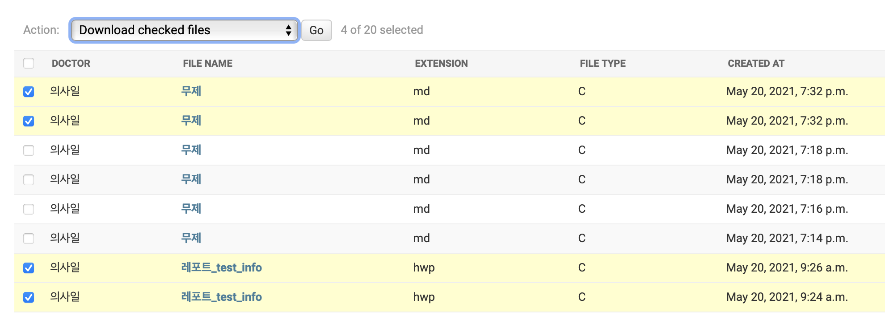

# 20210520

### django admin의 list에서 선택된 파일객체를 zip 파일로 다운받기(임시)

-   임시 기능: 구조나 최적화를 생각하지 않고 기능을 중점으로 구현

-   admin page의 여러 객체를 선택하고 객체에 포함된 파일을 다운로드 받기
    -   uploader: DRF에서 파일 업로드
    -   downloader: admin에서 파일 선택 후 다운로드

<br>

### Uploader

**models.py**

```python
class TempHospitalFiles(models.Model):
    doctor = models.ForeignKey(Doctor, on_delete=models.CASCADE)
    file_name = models.CharField(max_length=255, null=True)
    file_info = models.TextField(null=True)
    file_type = models.CharField(max_length=255, null=True)
    file = models.FileField(upload_to=_temp_directory_path)
    extension = models.CharField(max_length=255, null=True)
    created_at = models.DateTimeField(auto_now_add=True)
    updated_at = models.DateTimeField(auto_now=True)
```

-   파일 및 메타 정보를 저장할 Model 생성

    -   file_name, file_type, extension은 필터링 및 계층화를 위해 signal(pre_save)을 통해 저장

        ```python
        @receiver(pre_save, sender=TempHospitalFiles)
        def pre_save_temp_files(sender, **kwargs):
            instance = kwargs['instance']
            handler = FileHandler(instance)
            handler.set_attributes()
            instance.file_name = handler.file_name
            instance.file_type = handler.type
            instance.extension = handler.extension
        ```

    -   FileHandler: 파일 디렉터리를 설정하고, File 객체의 속성(file_name, file_type, extension) 설정

        ```python
        class FileHandler:
            def __init__(self, instance):
                self.file = instance.file
                self.file_type = None
                self.extension = None
                self.file_name = None
                self.container = {}
        
            def divide_file_string(self):
                full_name, extension = str(self.file.name).split('.')
                name_list = str(full_name).split('_')
        
                if len(name_list) == 1:
                    raise Exception('invalid file type')
        
                file_type, name = name_list[0], name_list[1:]
                if file_type in FILE_TYPE.keys():
                    file_type = FILE_TYPE[file_type]
                file_name = '_'.join(name)
                self.build_container(extension=extension, file_type=file_type, file_name=file_name)
        
            def build_container(self, **kwargs):
                self.container.update(**kwargs)
        
            def set_attributes(self):
                self.divide_file_string()
                [setattr(self, key, value) for key, value in self.container.items()]
        
        ```

        -   divide_file_string: File 객체에 저장되어있는 파일의 타입, 파일 포맷, 파일 이름을 분리
        -   build_container: container(dict) 속성에 분리된 문자열을 할당함
        -   set_attributes: container에 할당된 값을 FileHandler의 인스턴스 속성으로 설정
            -   refactoring: file_type, file_name, extension을 담고있는 자료구조로 분리하는것이 좋을지?

        

<br>

**views.py & serializers.py**

```python
# views.py
class TempFilesUpload(CreateAPIView):
    queryset = TempHospitalFiles.objects.all()
    serializer_class = TempFileSerializer
    permission_classes = [IsAuthenticated]
    
# serializers.py
class TempFileSerializer(serializers.ModelSerializer):
    file = serializers.FileField(use_url=False, write_only=True)

    class Meta:
        model = TempHospitalFiles
        fields = '__all__'
```

-   기본적인 views, serializer 구성
-   browsable API에서는 업로드 기능만 구현
    -   파일 확인 및 다운로드는 admin page에서 이루어짐


<br>

### Downloader

**files/admin.py**

```python 
class TempHospitalFilesAdmin(admin.ModelAdmin):
    fields = ['doctor', 'file', 'file_name', 'file_info', 'extension', 'file_type', 'created_at', 'updated_at']
    list_display = ['doctor', 'file_name', 'extension', 'file_type', 'created_at']
    list_filter = ['doctor', 'extension', 'file_type']
    readonly_fields = ['created_at', 'updated_at']
    list_per_page = 20
    list_display_links = ['file_name']
    actions = [download_files]


admin.site.register(TempHospitalFiles, TempHospitalFilesAdmin)
```

-   리스트에서 사용자가 원하는 객체를 체크하고 action에서 zip파일 형태로 다운로드

    ```python
    # action 동작을 위한 function
    @contextlib.contextmanager
    def get_memory_container():
        in_memory = io.BytesIO()
        try:
            yield in_memory
        finally:
            in_memory.close()
    
    
    def download_files(modeladmin, request, queryset):  # todo: refactoring
        # in_memory = io.BytesIO()
        with get_memory_container() as in_memory:
            with zipfile.ZipFile(in_memory, 'w', zipfile.ZIP_DEFLATED, False) as zip_file:
                for number, query in enumerate(queryset):
                    with open(query.file.path, 'rb') as query_file:
                        data = io.BytesIO(query_file.read())
                        zip_file.writestr(query.file.name, data.getvalue())
    
            in_memory.seek(0)
    
            response = HttpResponse(in_memory, content_type='application/zip')
            response['Content-Disposition'] = 'attachment; filename="compressed_health_file.zip"'
            return response
    ```

    -   get_memory_container: 메모리에 zip 파일을 생성하기 위한 임시 컨테이너 생성
        -   context manager를 통해 응답 후 컨테이너 제거(close)
    -   download_files: 선택된 객체의 파일을 임시 컨테이너에 생성된 zip파일에 압축 후 응답
        -   refactoring: zip 생성과 응답을 나누는것이 좋을듯

<br>

### Result



-   admin page에 저장된 파일 리스트 중 일부 선택

    -   전송될 때 동일한 파일 이름이더라도 저장 시 시간이 포함되므로 다른 이름으로 저장됨

-   'Go' 버튼 클릭 시

    

    -   위와 같이 폴더별로 정리된 파일을 다운로드 받게됨
    -   mac 환경에서 자동으로 압축이 해제되고 zip 파일은 휴지통으로 이동함

