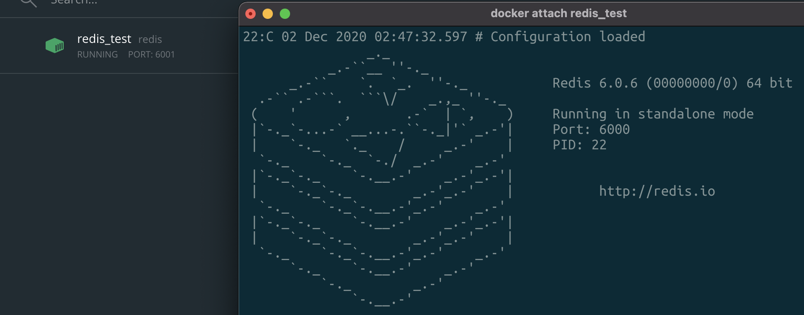
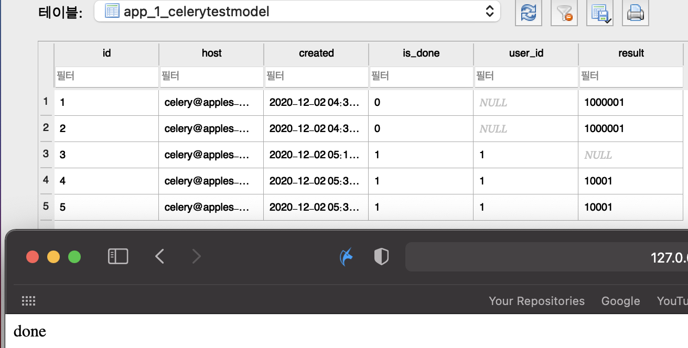
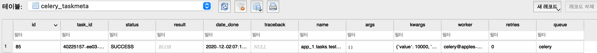
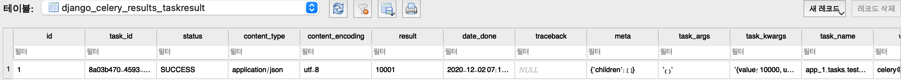
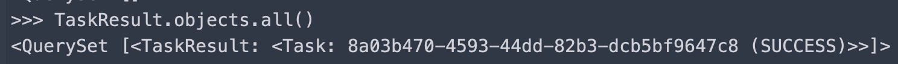

# 201202

### Celery Settings

```python
# config.celery_settings.celery.py
from __future__ import absolute_import, unicode_literals

import os
from datetime import timedelta

from celery import Celery
from celery.schedules import crontab

os.environ.setdefault('DJANGO_SETTINGS_MODULE', 'config.settings.local')

BASE_REDIS_URL = os.environ.get('REDIS_URL', 'redis://localhost:6001')
app = Celery('celery_settings')
app.config_from_object('django.conf:settings', namespace='CELERY')
app.autodiscover_tasks()

# celery - config
app.conf.broker_url = BASE_REDIS_URL
# app.conf.accept_content = ['json']
app.conf.result_backend = 'db+sqlite:///config/celery_settings/results/results.sqlite'
app.conf.result_extended = True
app.conf.beat_scheduler = 'django_celery_beat.schedulers.DatabaseScheduler'

# set schedules
app.conf.beat_schedule = {
    'add-every-minute-crontab': {
        'task': 'multiply_two_numbers',
        'schedule': crontab(hour=1, minute=3),
        'args': (16, 16)
    },
    'add-every-5-seconds': {
        'task': 'multiply_two_numbers',
        'schedule': timedelta(seconds=5),
        'args': (16, 16)
    },
    'add-every-30-seconds': {
        'task': 'sum_two_numbers',
        'schedule': timedelta(seconds=30),
        'args': (16, 16)
    },
}

```

<br>

```python
# config.settings.local
import redis
import djcelery

from .base import *

DEBUG = True
ALLOWED_HOSTS = ['*']

# debug toolbar
INSTALLED_APPS += [
    'debug_toolbar',
    'djcelery',
    'django_celery_beat',
    'django_celery_results',
]

MIDDLEWARE += ['debug_toolbar.middleware.DebugToolbarMiddleware']
INTERNAL_IPS = [
    '127.0.0.1',
]

# database
DATABASES = {
    'default': {
        'ENGINE': 'django.db.backends.sqlite3',
        'NAME': os.path.join(BASE_DIR, 'db.sqlite3'),
    }
}

# celery for local setting
djcelery.setup_loader()

# redis for local setting
REDIS_HOST = 'localhost'
REDIS_PORT = 6001  
REDIS_DB = 1
REDIS_CONN_POOL_1 = redis.ConnectionPool(host=REDIS_HOST, port=REDIS_PORT, db=1, decode_responses=True)
```

<br>

-   redis는 docker를 이용해 설정됨(6001:6000)



```python
# external terminal(mac)
$ docker start redis_test
$ docker attach redis_test

# internal terminal(docker)
$ redis-server --port 6000 --daemonize yes  # background mode
$ redis-cli -p 6000 shutdown  # 종료
```

<br>

### Celery Task

```python
# apps.app_1.tasks.py
import random
from celery import shared_task

# beat
from django.contrib.auth import get_user_model

from app_1.models import CeleryTestModel
from config.celery_settings.celery import app

User = get_user_model()


@shared_task(name="sum_two_numbers")
def add(x, y):
    return 0


@shared_task(name="multiply_two_numbers")
def mul(x, y):
    total = x * (y * random.randint(3, 100))
    return total


@shared_task(name="sum_list_numbers")
def xsum(numbers):
    return sum(numbers)


# normal task
@app.task(bind=True)
def test_task(self, value=None, user_id=None):
    user = User.objects.get(id=user_id)
    obj = CeleryTestModel.objects.create(user=user, host=self.request.hostname)

    # task
    self.update_state(state="PROGRESS")
    while True:
        value += 1
        if value > 10000:
            result = value
            break
    self.update_state(state="DONE", meta={'result': result})  # backend 설정 없음 - 동작x
    obj.result = result
    obj.is_done = True
    obj.save()
    return result
```

**bind**: task 데코레이터의 bind 인자는 task 인스턴스(self)에 접근 가능토록 한다.

[Celery task option](https://docs.celeryproject.org/en/stable/userguide/tasks.html?highlight=bind#general)

<br>

### Test View

```python
# views.py

# url: http://127.0.0.1:8000/accounts/celery/test/
class CeleryTestView(View):
    def get(self, request, *args, **kwargs):
        user_id = self.request.user.id

        # start task
        test_task.delay(value=100, user_id=user_id)

        return HttpResponse('done')
```

<br>




###django_celery_results: 데이터베이스 설정 관련 주의

```python
app.conf.broker_url = BASE_REDIS_URL
# app.conf.result_backend = 'db+sqlite:///config/celery_settings/results/results.sqlite'  # 1
app.conf.result_backend = 'django-db'  # 2
app.conf.result_extended = True
app.conf.beat_scheduler = 'django_celery_beat.schedulers.DatabaseScheduler'
app.conf.beat_schedule = {
```

**\# 1**: taskmeta 테이블을 포함한 sqlite 데이터베이스를 새로 생성한다.

-   **SQLAlachemy**를 이용해 테이블을 생성(**추측**)

-   **django_celery_result_taskresult**가 아닌 **celery_taskmeta** 테이블이 생성된다(django celery result 적용 X)

-   테이블 생성 시 'result'를 Blob 타입으로 생성 -> 저장된 데이터 확인 시 변환 필요

    

**\# 2**: django에 셋팅되어있는 데이터베이스에 테이블을 생성한다.

-   django에서 migration 시 생성된 테이블(**django_celery_results_taskresult**)에 데이터를 추가한다.

-   데이터 타입이 django에 적합한 형태(?)로 생성된다.

    

-   TaskModel을 이용해 shell에서 접근 가능 - 테스트 용이

    

